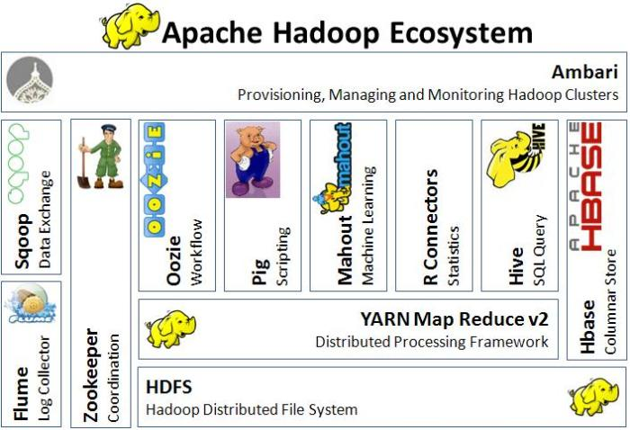
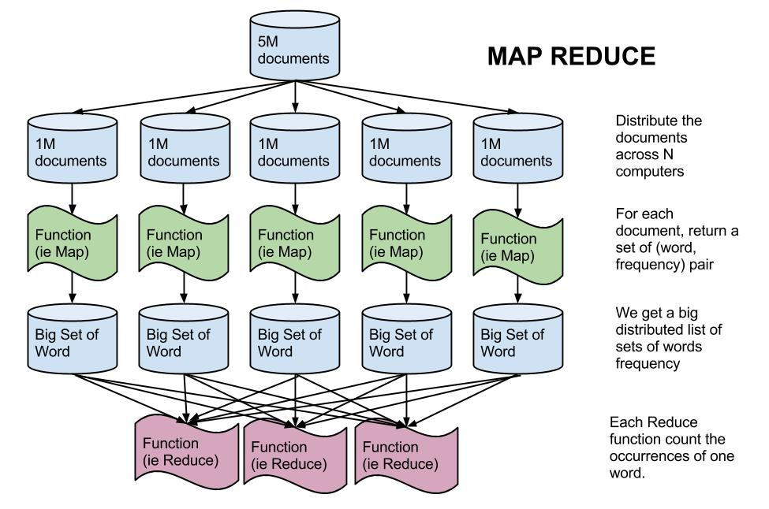
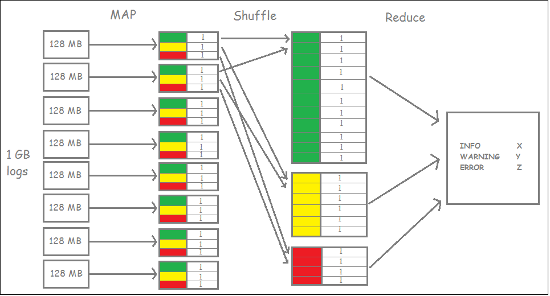
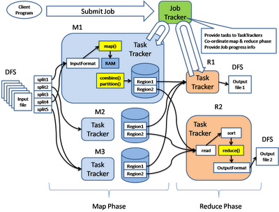
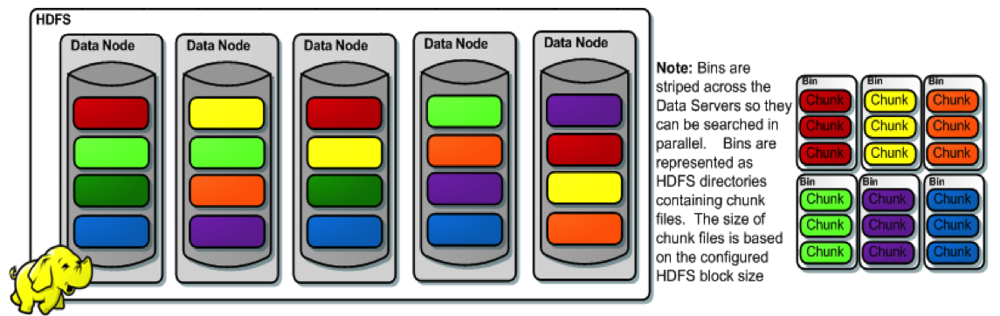
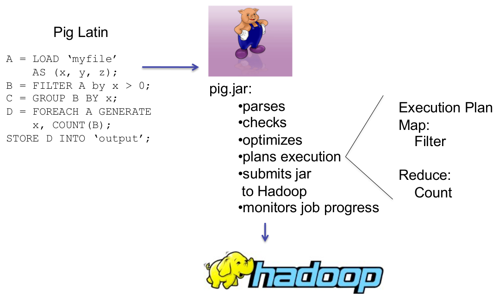
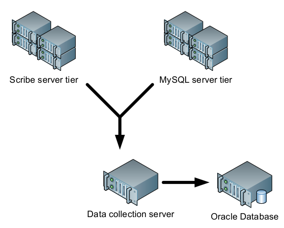

= Pig vs Hive
Tomasz Borek 
v1.2, 10th September 2015
:toc:
:hardbreaks:
:icons: font

NOTE: This documentation was done with Asciidoctor 0.1.4 [http://asciidoctor.org]

.Introduction to Pig and Hive along with simple comparison of both.
****
Aim of this work is to introduce others to Pig, Hive and Hadoop, offering basic understanding of running Map-Reduce jobs via each.
Along the way I hope to illustrate that comparing Pig *VERSUS* Hadoop is rather shallow, as with each passing realease both are made to cooperate more and more.

If however, we are to offer a shallow distinction, that it would go along the following lines:

. the higher familiarity with SQL the better choice Hive becomes
. one's purpose requiring heavy scripting or direct use of Perl/Python would suggest Pig
. structured data as of now are better in Hive (not big difference however) while unstructured: in Pig

The more advanced usages however tend to show that using both is quite smart and allows to choose between more ways to achieve same purposes.

CAUTION: Sadly, performance aspect of the comparison, as requiring much more work (and stricter) was left out from this work. All work was done on single-node cluster.

Project:: Methods and Systems of Large-scale Computing (Polish: Metody i Systemy Obliczeń Wielkiej Skali, MISOWS)
Lead by:: http://www.icsr.agh.edu.pl/~malawski/[dr Maciej Malawski]
Author:: Tomasz.Borek@gmail.com, https://twitter.com/LAFK_pl/[@LAFK_pl]
****
== Setup

I chose LXC as a container for whole work. Hadoop was obvious as a platform, so were Pig and Hive. This meant I needed Java, and I chose Java 8. This part of documentation explains <<_why_such_setup>> and has a technical steps for <<_installation>> of required software.

=== Installation
Project set up guide, in steps, to set up necessary technology:

LXC:: 
`sudo apt-get install lxc; lxc-create -t ubuntu -n test1` installs and creates a test container
[IMPORTANT]
.LXC and Hadoop?
====
Both technologies are great together, but you may want to read on them to nicely exploit their capabilities as a combo.

. https://github.com/t3rmin4t0r/notes/wiki/Using-LXC-for-hadoop[To quickly grasp LXC and Hadoop combo], thank you Terminator :-)
. https://ofirm.wordpress.com/2014/01/05/creating-a-virtualized-fully-distributed-hadoop-cluster-using-linux-containers/[Full setup process including clustering and network], excellent piece by Ofir Manor, great thanks!
====
Java 8:: 
Ubuntu LXC container comes with little packages. To have Oracle Java I needed to add a PPA repository. 
I summed this stage on my blog https://lafkblogs.wordpress.com/2015/09/14/java8-in-lxc-or-lxc-and-add-apt-repository/

Hadoop 2.7.1:: single-node cluster, container required `rsync` (`ssh` was present).
Installed per original docs: http://hadoop.apache.org/docs/current/hadoop-project-dist/hadoop-common/SingleCluster.html
In stand-alone mode: http://hadoop.apache.org/docs/current/hadoop-project-dist/hadoop-common/SingleCluster.html#Standalone_Operation

NOTE: After downloading Hadoop you need to put the file in container, use `sudo mv hadoopArchive /var/lib/lxc/containerName/rootfs/tmp`

TIP: LXC enables easy and lightweight cluster setup on one machine. See http://hadoop.apache.org/docs/current/hadoop-project-dist/hadoop-common/ClusterSetup.html[relevant Hadoop docs (2.7.1 when I wrote this)]

[listing]
.Verify installation with example
----
  $ mkdir input
  $ cp etc/hadoop/*.xml input
  $ bin/hadoop jar share/hadoop/mapreduce/hadoop-mapreduce-examples-2.7.1.jar grep input output 'dfs[a-z.]+'
  $ cat output/*
----

Pig:: choose your own version, when I type this 0.15 is latest. Still, docs are on 0.14.
[listing]
.Install and verify
----
  $ wget http://ftp.ps.pl/pub/apache/pig/latest/pig-0.15.0.tar.gz
  $ tar -xf pig-0.15.0.tar.gz
  $ cd pig-0.15.0
  $ export PATH=/tmp/pig-0.15.0/bin/:$PATH # recommended though: add in profile
  $ pig -h # should now display usage
  $ export HADOOP_CONF_DIR=/tmp/hadoop-2.7.1/input/ # otherwise forget running map-reduce mode
  $ pig # should bring up GRUNT shell, like so:
  grunt>
----

Hive:: choose release from http://ftp.piotrkosoft.net/pub/mirrors/ftp.apache.org/hive/
[listing]
.Install and verify
----
  $ wget http://ftp.piotrkosoft.net/pub/mirrors/ftp.apache.org/hive/hive-1.2.1/apache-hive-1.2.1-bin.tar.gz
  $ tar -xzvf apache-hive-1.2.1-bin.tar.gz
  $ cd apache-hive-1.2.1-bin
  $ export HIVE_HOME=$(pwd)
  $ echo $HIVE_HOME
  $ export PATH=$HIVE_HOME/bin:$PATH
  $ export HADOOP_HOME=/tmp/hadoop-2.7.1/
  $ hive

Logging initialized using configuration in jar:file:/tmp/apache-hive-1.2.1-bin/lib/hive-common-1.2.1.jar!/hive-log4j.properties
hive> 
----

All steps were done on GNU/Linux, namely Ubuntu 14.04 LTS. Kernel version: #62~14.04.1-Ubuntu SMP Tue Aug 11 16:27:16 UTC 2015.

=== Why such setup?

I chose *LXC* over full virtualization for following reasons:

. lighter (overhead, start and stop, overall)
. wanted to try it and have Hadoop in it
. cheaper and easier to set up cluster on one laptop (RAM, SSD now ain't so large)

I chose *Java 8* because:

. http://wiki.apache.org/hadoop/HadoopJavaVersions restricts Java usage (Hotspot, late 6 or later)
. Oracle's flavour is a tad easier to install on my Ubuntu version
. version 8 is by now (September 2015) the only supported version (which may carry weight for some)

Version 2.7.1 of Hadoop is current one. Single-node cluster for simple comparison is quite enough, as I'm not delving into performance aspects due to lack of time.

Rest of the choices are rather self-explanatory once one looks at project aim.

== Behind Technology

This part tries illustrating several concepts behind Map Reduce paradigm, Hadoop platform, and finally Pig and Hive tools. It's a short part, with links for further reading, an extra to real project aim that was created to answer some question potential reader might have about tools used here.

View from above generally looks like that:

And this all rests on Hadoop, via HDFS. Before we get to any of those in detail however, I'd like to say few words about Big Data and it's problems. Big Data is VERY often talked about, quoted to be this or that. There's nice quote on the Internet that explains that confusion:

Big Data:: for now we'll assume it's working with data in sufficiently large volume, where _sufficiently_ means that single-thread or sequential way of working with it will be slow (or not fast) enough to impact the reason we reach for that data anyway.

Problems:

. Various data sources: user feeds, partner feeds, large DBs, FTP places, social media...
. Various data, structured, unstructured, as text, as image...
. The sheer amount of data parsed daily or even hourly (depends on scale)
. Retention of such data

There are more, but let's shortly discuss these four.

**Various data sources** make it hard to uniformly gather and process data or even expect it at certain places and/or intervals. Requires elasticity.
**Data diversity** means we can't think of one structure that will "hold it" and be any good at it. The data often require complex adjustments prior to being stored.
**Sheer amount** means filtering is *a must*. No human being can process hundreds of megabytes of data, and with Big Data we may even be talking millions of petabytes.
**Data retention** requires us to think how this data will be stored, where, and how long.

=== Map Reduce
is a paradigm. In world where working through tera-(or more)-bytes of data needs to be done close to real-time, working with said data sequentially just won't suffice.

Therefore, an idea was proposed to split the work in two stages and split the data into as many pieces as it's good for cluster we have at the moment.

Map:: 
During Map, our workers take up data pieces assigned to them and try to do preliminary stages of work, reaching "somewhere". Upon finish, partially processed data is handed over. Often we say workers here are called _mappers_ or _emitters_.

Reduce:: 
_Reductors_ take over work done by _mappers_ and apply final touches.

NOTE: Work done by mappers may get _shuffled_. It's preliminary sorting, so similar data arrives at same set of reductors.

Final stage is merging and reporting the result.

If we wanted to see example with shuffling, Packt Publishing had a nice one within their M/R introduction, counting messages of different log levels:

Map/Reduce, often abbreviated to MR or M/R, quickly became a common paradigm for Big Data crunchers. It allows to deal with huge data, of great variety and coming from different sources. It filters it and allows for pre-processing (during mapping phase or even prior to). It makes working with Big Data manageable. 

It was a matter of time, it was employed more.

=== Hadoop
is a platform for MR jobs. If I were to show how MR looks like on Hadoop, that would be best:

Important pillar of Hadoop is it's filesystem, *HDFS*. HDFS makes sure splits and storing of data are being taken care of, and well.

See links for more. 

=== Pig
an execution engine atop Hadoop. Protects from changes in Hadoop, offers functionality that previously had to be re-developed (join, filter, etc.).
Pig was originally developed at Yahoo Research so their researchers could query their data without boring through Hadoop MR jobs. 

PigLatin is easier to learn than Java and doesn't require Java IDE (or Java programmer, for that matter). It's a data flow language.

TIP: Pig resides on user machine, submits the jobs to cluster. Therefore, no need to install cluster connectors or set Pig on cluster.

There's a good introduction to Pig, by Cloudera. Available as PDF, see links for more.

=== Hive
is also an execution engine atop Hadoop. It started as FB crunched it's Big Data:

Data collection server above was Hadoop, and there MR jobs were launched. However:

. CLI for end-users was missing
. often folks would NOT run their ad-hoc queries for MR jobs were too tedious for them
. FB data is relational, there was no support to reflect it and use it

Thus Hive was born.

== Comparison of sessions

Hadoop offers Map/Reduce capabilities, however these are unwieldy, while powerful. Both Pig and Hive were created to make them easier to use.

[[app-listing]]
[source,bash]
.Raw Hadoop Map Reduce "hello world" example: word count
----
root@test1:/tmp/hadoop-2.7.1# bin/hadoop jar share/hadoop/mapreduce/hadoop-mapreduce-examples-2.7.1.jar grep input output 'dfs[a-z.]+'
15/09/15 12:25:10 INFO Configuration.deprecation: session.id is deprecated. Instead, use dfs.metrics.session-id
15/09/15 12:25:10 INFO jvm.JvmMetrics: Initializing JVM Metrics with processName=JobTracker, sessionId=
15/09/15 12:25:11 INFO input.FileInputFormat: Total input paths to process : 8
15/09/15 12:25:12 INFO mapreduce.JobSubmitter: number of splits:8
15/09/15 12:25:12 INFO mapreduce.JobSubmitter: Submitting tokens for job: job_local1461732489_0001
15/09/15 12:25:13 INFO mapreduce.Job: The url to track the job: http://localhost:8080/
15/09/15 12:25:13 INFO mapreduce.Job: Running job: job_local1461732489_0001
15/09/15 12:25:13 INFO mapred.LocalJobRunner: OutputCommitter set in config null
15/09/15 12:25:13 INFO output.FileOutputCommitter: File Output Committer Algorithm version is 1
15/09/15 12:25:13 INFO mapred.LocalJobRunner: OutputCommitter is org.apache.hadoop.mapreduce.lib.output.FileOutputCommitter
15/09/15 12:25:13 INFO mapred.LocalJobRunner: Waiting for map tasks
15/09/15 12:25:13 INFO mapred.LocalJobRunner: Starting task: attempt_local1461732489_0001_m_000000_0
15/09/15 12:25:13 INFO output.FileOutputCommitter: File Output Committer Algorithm version is 1
15/09/15 12:25:13 INFO mapred.Task:  Using ResourceCalculatorProcessTree : [ ]
15/09/15 12:25:13 INFO mapred.MapTask: Processing split: file:/tmp/hadoop-2.7.1/input/hadoop-policy.xml:0+9683
15/09/15 12:25:14 INFO mapred.MapTask: (EQUATOR) 0 kvi 26214396(104857584)
15/09/15 12:25:14 INFO mapred.MapTask: mapreduce.task.io.sort.mb: 100
15/09/15 12:25:14 INFO mapred.MapTask: soft limit at 83886080
15/09/15 12:25:14 INFO mapred.MapTask: bufstart = 0; bufvoid = 104857600
15/09/15 12:25:14 INFO mapred.MapTask: kvstart = 26214396; length = 6553600
15/09/15 12:25:14 INFO mapred.MapTask: Map output collector class = org.apache.hadoop.mapred.MapTask$MapOutputBuffer
15/09/15 12:25:14 INFO mapreduce.Job: Job job_local1461732489_0001 running in uber mode : false
15/09/15 12:25:14 INFO mapreduce.Job:  map 0% reduce 0%
15/09/15 12:25:14 INFO mapred.LocalJobRunner: 
15/09/15 12:25:14 INFO mapred.MapTask: Starting flush of map output
15/09/15 12:25:14 INFO mapred.MapTask: Spilling map output
15/09/15 12:25:14 INFO mapred.MapTask: bufstart = 0; bufend = 17; bufvoid = 104857600
15/09/15 12:25:14 INFO mapred.MapTask: kvstart = 26214396(104857584); kvend = 26214396(104857584); length = 1/6553600
15/09/15 12:25:14 INFO mapred.MapTask: Finished spill 0
15/09/15 12:25:14 INFO mapred.Task: Task:attempt_local1461732489_0001_m_000000_0 is done. And is in the process of committing
15/09/15 12:25:14 INFO mapred.LocalJobRunner: map
15/09/15 12:25:14 INFO mapred.Task: Task 'attempt_local1461732489_0001_m_000000_0' done.
15/09/15 12:25:14 INFO mapred.LocalJobRunner: Finishing task: attempt_local1461732489_0001_m_000000_0
15/09/15 12:25:14 INFO mapred.LocalJobRunner: Starting task: attempt_local1461732489_0001_m_000001_0
15/09/15 12:25:14 INFO output.FileOutputCommitter: File Output Committer Algorithm version is 1
15/09/15 12:25:14 INFO mapred.Task:  Using ResourceCalculatorProcessTree : [ ]
15/09/15 12:25:14 INFO mapred.MapTask: Processing split: file:/tmp/hadoop-2.7.1/input/kms-site.xml:0+5511
15/09/15 12:25:14 INFO mapred.MapTask: (EQUATOR) 0 kvi 26214396(104857584)
15/09/15 12:25:14 INFO mapred.MapTask: mapreduce.task.io.sort.mb: 100
15/09/15 12:25:14 INFO mapred.MapTask: soft limit at 83886080
15/09/15 12:25:14 INFO mapred.MapTask: bufstart = 0; bufvoid = 104857600
15/09/15 12:25:14 INFO mapred.MapTask: kvstart = 26214396; length = 6553600
15/09/15 12:25:14 INFO mapred.MapTask: Map output collector class = org.apache.hadoop.mapred.MapTask$MapOutputBuffer
15/09/15 12:25:14 INFO mapred.LocalJobRunner: 
15/09/15 12:25:14 INFO mapred.MapTask: Starting flush of map output
15/09/15 12:25:14 INFO mapred.Task: Task:attempt_local1461732489_0001_m_000001_0 is done. And is in the process of committing
15/09/15 12:25:14 INFO mapred.LocalJobRunner: map
15/09/15 12:25:14 INFO mapred.Task: Task 'attempt_local1461732489_0001_m_000001_0' done.
15/09/15 12:25:14 INFO mapred.LocalJobRunner: Finishing task: attempt_local1461732489_0001_m_000001_0
15/09/15 12:25:14 INFO mapred.LocalJobRunner: Starting task: attempt_local1461732489_0001_m_000002_0
15/09/15 12:25:14 INFO output.FileOutputCommitter: File Output Committer Algorithm version is 1
15/09/15 12:25:14 INFO mapred.Task:  Using ResourceCalculatorProcessTree : [ ]
15/09/15 12:25:14 INFO mapred.MapTask: Processing split: file:/tmp/hadoop-2.7.1/input/capacity-scheduler.xml:0+4436
15/09/15 12:25:15 INFO mapreduce.Job:  map 100% reduce 0%
15/09/15 12:25:15 INFO mapred.MapTask: (EQUATOR) 0 kvi 26214396(104857584)
15/09/15 12:25:15 INFO mapred.MapTask: mapreduce.task.io.sort.mb: 100
15/09/15 12:25:15 INFO mapred.MapTask: soft limit at 83886080
15/09/15 12:25:15 INFO mapred.MapTask: bufstart = 0; bufvoid = 104857600
15/09/15 12:25:15 INFO mapred.MapTask: kvstart = 26214396; length = 6553600
15/09/15 12:25:15 INFO mapred.MapTask: Map output collector class = org.apache.hadoop.mapred.MapTask$MapOutputBuffer
15/09/15 12:25:15 INFO mapred.LocalJobRunner: 
15/09/15 12:25:15 INFO mapred.MapTask: Starting flush of map output
15/09/15 12:25:15 INFO mapred.Task: Task:attempt_local1461732489_0001_m_000002_0 is done. And is in the process of committing
15/09/15 12:25:15 INFO mapred.LocalJobRunner: map
15/09/15 12:25:15 INFO mapred.Task: Task 'attempt_local1461732489_0001_m_000002_0' done.
15/09/15 12:25:15 INFO mapred.LocalJobRunner: Finishing task: attempt_local1461732489_0001_m_000002_0
15/09/15 12:25:15 INFO mapred.LocalJobRunner: Starting task: attempt_local1461732489_0001_m_000003_0
15/09/15 12:25:15 INFO output.FileOutputCommitter: File Output Committer Algorithm version is 1
15/09/15 12:25:15 INFO mapred.Task:  Using ResourceCalculatorProcessTree : [ ]
15/09/15 12:25:15 INFO mapred.MapTask: Processing split: file:/tmp/hadoop-2.7.1/input/kms-acls.xml:0+3518
15/09/15 12:25:15 INFO mapred.MapTask: (EQUATOR) 0 kvi 26214396(104857584)
15/09/15 12:25:15 INFO mapred.MapTask: mapreduce.task.io.sort.mb: 100
15/09/15 12:25:15 INFO mapred.MapTask: soft limit at 83886080
15/09/15 12:25:15 INFO mapred.MapTask: bufstart = 0; bufvoid = 104857600
15/09/15 12:25:15 INFO mapred.MapTask: kvstart = 26214396; length = 6553600
15/09/15 12:25:15 INFO mapred.MapTask: Map output collector class = org.apache.hadoop.mapred.MapTask$MapOutputBuffer
15/09/15 12:25:15 INFO mapred.LocalJobRunner: 
15/09/15 12:25:15 INFO mapred.MapTask: Starting flush of map output
15/09/15 12:25:15 INFO mapred.Task: Task:attempt_local1461732489_0001_m_000003_0 is done. And is in the process of committing
15/09/15 12:25:15 INFO mapred.LocalJobRunner: map
15/09/15 12:25:15 INFO mapred.Task: Task 'attempt_local1461732489_0001_m_000003_0' done.
15/09/15 12:25:15 INFO mapred.LocalJobRunner: Finishing task: attempt_local1461732489_0001_m_000003_0
15/09/15 12:25:15 INFO mapred.LocalJobRunner: Starting task: attempt_local1461732489_0001_m_000004_0
15/09/15 12:25:15 INFO output.FileOutputCommitter: File Output Committer Algorithm version is 1
15/09/15 12:25:15 INFO mapred.Task:  Using ResourceCalculatorProcessTree : [ ]
15/09/15 12:25:15 INFO mapred.MapTask: Processing split: file:/tmp/hadoop-2.7.1/input/hdfs-site.xml:0+775
15/09/15 12:25:15 INFO mapred.MapTask: (EQUATOR) 0 kvi 26214396(104857584)
15/09/15 12:25:15 INFO mapred.MapTask: mapreduce.task.io.sort.mb: 100
15/09/15 12:25:15 INFO mapred.MapTask: soft limit at 83886080
15/09/15 12:25:15 INFO mapred.MapTask: bufstart = 0; bufvoid = 104857600
15/09/15 12:25:15 INFO mapred.MapTask: kvstart = 26214396; length = 6553600
15/09/15 12:25:15 INFO mapred.MapTask: Map output collector class = org.apache.hadoop.mapred.MapTask$MapOutputBuffer
15/09/15 12:25:15 INFO mapred.LocalJobRunner: 
15/09/15 12:25:15 INFO mapred.MapTask: Starting flush of map output
15/09/15 12:25:15 INFO mapred.Task: Task:attempt_local1461732489_0001_m_000004_0 is done. And is in the process of committing
15/09/15 12:25:15 INFO mapred.LocalJobRunner: map
15/09/15 12:25:15 INFO mapred.Task: Task 'attempt_local1461732489_0001_m_000004_0' done.
15/09/15 12:25:15 INFO mapred.LocalJobRunner: Finishing task: attempt_local1461732489_0001_m_000004_0
15/09/15 12:25:15 INFO mapred.LocalJobRunner: Starting task: attempt_local1461732489_0001_m_000005_0
15/09/15 12:25:16 INFO output.FileOutputCommitter: File Output Committer Algorithm version is 1
15/09/15 12:25:16 INFO mapred.Task:  Using ResourceCalculatorProcessTree : [ ]
15/09/15 12:25:16 INFO mapred.MapTask: Processing split: file:/tmp/hadoop-2.7.1/input/core-site.xml:0+774
15/09/15 12:25:16 INFO mapred.MapTask: (EQUATOR) 0 kvi 26214396(104857584)
15/09/15 12:25:16 INFO mapred.MapTask: mapreduce.task.io.sort.mb: 100
15/09/15 12:25:16 INFO mapred.MapTask: soft limit at 83886080
15/09/15 12:25:16 INFO mapred.MapTask: bufstart = 0; bufvoid = 104857600
15/09/15 12:25:16 INFO mapred.MapTask: kvstart = 26214396; length = 6553600
15/09/15 12:25:16 INFO mapred.MapTask: Map output collector class = org.apache.hadoop.mapred.MapTask$MapOutputBuffer
15/09/15 12:25:16 INFO mapred.LocalJobRunner: 
15/09/15 12:25:16 INFO mapred.MapTask: Starting flush of map output
15/09/15 12:25:16 INFO mapred.Task: Task:attempt_local1461732489_0001_m_000005_0 is done. And is in the process of committing
15/09/15 12:25:16 INFO mapred.LocalJobRunner: map
15/09/15 12:25:16 INFO mapred.Task: Task 'attempt_local1461732489_0001_m_000005_0' done.
15/09/15 12:25:16 INFO mapred.LocalJobRunner: Finishing task: attempt_local1461732489_0001_m_000005_0
15/09/15 12:25:16 INFO mapred.LocalJobRunner: Starting task: attempt_local1461732489_0001_m_000006_0
15/09/15 12:25:16 INFO output.FileOutputCommitter: File Output Committer Algorithm version is 1
15/09/15 12:25:16 INFO mapred.Task:  Using ResourceCalculatorProcessTree : [ ]
15/09/15 12:25:16 INFO mapred.MapTask: Processing split: file:/tmp/hadoop-2.7.1/input/yarn-site.xml:0+690
15/09/15 12:25:16 INFO mapred.MapTask: (EQUATOR) 0 kvi 26214396(104857584)
15/09/15 12:25:16 INFO mapred.MapTask: mapreduce.task.io.sort.mb: 100
15/09/15 12:25:16 INFO mapred.MapTask: soft limit at 83886080
15/09/15 12:25:16 INFO mapred.MapTask: bufstart = 0; bufvoid = 104857600
15/09/15 12:25:16 INFO mapred.MapTask: kvstart = 26214396; length = 6553600
15/09/15 12:25:16 INFO mapred.MapTask: Map output collector class = org.apache.hadoop.mapred.MapTask$MapOutputBuffer
15/09/15 12:25:16 INFO mapred.LocalJobRunner: 
15/09/15 12:25:16 INFO mapred.MapTask: Starting flush of map output
15/09/15 12:25:16 INFO mapred.Task: Task:attempt_local1461732489_0001_m_000006_0 is done. And is in the process of committing
15/09/15 12:25:16 INFO mapred.LocalJobRunner: map
15/09/15 12:25:16 INFO mapred.Task: Task 'attempt_local1461732489_0001_m_000006_0' done.
15/09/15 12:25:16 INFO mapred.LocalJobRunner: Finishing task: attempt_local1461732489_0001_m_000006_0
15/09/15 12:25:16 INFO mapred.LocalJobRunner: Starting task: attempt_local1461732489_0001_m_000007_0
15/09/15 12:25:16 INFO output.FileOutputCommitter: File Output Committer Algorithm version is 1
15/09/15 12:25:16 INFO mapred.Task:  Using ResourceCalculatorProcessTree : [ ]
15/09/15 12:25:16 INFO mapred.MapTask: Processing split: file:/tmp/hadoop-2.7.1/input/httpfs-site.xml:0+620
15/09/15 12:25:16 INFO mapred.MapTask: (EQUATOR) 0 kvi 26214396(104857584)
15/09/15 12:25:16 INFO mapred.MapTask: mapreduce.task.io.sort.mb: 100
15/09/15 12:25:16 INFO mapred.MapTask: soft limit at 83886080
15/09/15 12:25:16 INFO mapred.MapTask: bufstart = 0; bufvoid = 104857600
15/09/15 12:25:16 INFO mapred.MapTask: kvstart = 26214396; length = 6553600
15/09/15 12:25:16 INFO mapred.MapTask: Map output collector class = org.apache.hadoop.mapred.MapTask$MapOutputBuffer
15/09/15 12:25:16 INFO mapred.LocalJobRunner: 
15/09/15 12:25:16 INFO mapred.MapTask: Starting flush of map output
15/09/15 12:25:16 INFO mapred.Task: Task:attempt_local1461732489_0001_m_000007_0 is done. And is in the process of committing
15/09/15 12:25:16 INFO mapred.LocalJobRunner: map
15/09/15 12:25:16 INFO mapred.Task: Task 'attempt_local1461732489_0001_m_000007_0' done.
15/09/15 12:25:16 INFO mapred.LocalJobRunner: Finishing task: attempt_local1461732489_0001_m_000007_0
15/09/15 12:25:16 INFO mapred.LocalJobRunner: map task executor complete.
15/09/15 12:25:16 INFO mapred.LocalJobRunner: Waiting for reduce tasks
15/09/15 12:25:16 INFO mapred.LocalJobRunner: Starting task: attempt_local1461732489_0001_r_000000_0
15/09/15 12:25:16 INFO output.FileOutputCommitter: File Output Committer Algorithm version is 1
15/09/15 12:25:16 INFO mapred.Task:  Using ResourceCalculatorProcessTree : [ ]
15/09/15 12:25:16 INFO mapred.ReduceTask: Using ShuffleConsumerPlugin: org.apache.hadoop.mapreduce.task.reduce.Shuffle@469ef749
15/09/15 12:25:16 INFO reduce.MergeManagerImpl: MergerManager: memoryLimit=368102592, maxSingleShuffleLimit=92025648, mergeThreshold=242947728, ioSortFactor=10, memToMemMergeOutputsThreshold=10
15/09/15 12:25:16 INFO reduce.EventFetcher: attempt_local1461732489_0001_r_000000_0 Thread started: EventFetcher for fetching Map Completion Events
15/09/15 12:25:16 INFO reduce.LocalFetcher: localfetcher#1 about to shuffle output of map attempt_local1461732489_0001_m_000007_0 decomp: 2 len: 6 to MEMORY
15/09/15 12:25:16 INFO reduce.InMemoryMapOutput: Read 2 bytes from map-output for attempt_local1461732489_0001_m_000007_0
15/09/15 12:25:16 INFO reduce.MergeManagerImpl: closeInMemoryFile -> map-output of size: 2, inMemoryMapOutputs.size() -> 1, commitMemory -> 0, usedMemory ->2
15/09/15 12:25:16 INFO reduce.LocalFetcher: localfetcher#1 about to shuffle output of map attempt_local1461732489_0001_m_000000_0 decomp: 21 len: 25 to MEMORY
15/09/15 12:25:16 INFO reduce.InMemoryMapOutput: Read 21 bytes from map-output for attempt_local1461732489_0001_m_000000_0
15/09/15 12:25:16 INFO reduce.MergeManagerImpl: closeInMemoryFile -> map-output of size: 21, inMemoryMapOutputs.size() -> 2, commitMemory -> 2, usedMemory ->23
15/09/15 12:25:16 INFO reduce.LocalFetcher: localfetcher#1 about to shuffle output of map attempt_local1461732489_0001_m_000001_0 decomp: 2 len: 6 to MEMORY
15/09/15 12:25:16 INFO reduce.InMemoryMapOutput: Read 2 bytes from map-output for attempt_local1461732489_0001_m_000001_0
15/09/15 12:25:17 INFO reduce.MergeManagerImpl: closeInMemoryFile -> map-output of size: 2, inMemoryMapOutputs.size() -> 3, commitMemory -> 23, usedMemory ->25
15/09/15 12:25:17 INFO reduce.LocalFetcher: localfetcher#1 about to shuffle output of map attempt_local1461732489_0001_m_000004_0 decomp: 2 len: 6 to MEMORY
15/09/15 12:25:17 INFO reduce.InMemoryMapOutput: Read 2 bytes from map-output for attempt_local1461732489_0001_m_000004_0
15/09/15 12:25:17 INFO reduce.MergeManagerImpl: closeInMemoryFile -> map-output of size: 2, inMemoryMapOutputs.size() -> 4, commitMemory -> 25, usedMemory ->27
15/09/15 12:25:17 INFO reduce.LocalFetcher: localfetcher#1 about to shuffle output of map attempt_local1461732489_0001_m_000002_0 decomp: 2 len: 6 to MEMORY
15/09/15 12:25:17 INFO reduce.InMemoryMapOutput: Read 2 bytes from map-output for attempt_local1461732489_0001_m_000002_0
15/09/15 12:25:17 INFO reduce.MergeManagerImpl: closeInMemoryFile -> map-output of size: 2, inMemoryMapOutputs.size() -> 5, commitMemory -> 27, usedMemory ->29
15/09/15 12:25:17 WARN io.ReadaheadPool: Failed readahead on ifile
EBADF: Bad file descriptor
	at org.apache.hadoop.io.nativeio.NativeIO$POSIX.posix_fadvise(Native Method)
	at org.apache.hadoop.io.nativeio.NativeIO$POSIX.posixFadviseIfPossible(NativeIO.java:267)
	at org.apache.hadoop.io.nativeio.NativeIO$POSIX$CacheManipulator.posixFadviseIfPossible(NativeIO.java:146)
	at org.apache.hadoop.io.ReadaheadPool$ReadaheadRequestImpl.run(ReadaheadPool.java:206)
	at java.util.concurrent.ThreadPoolExecutor.runWorker(ThreadPoolExecutor.java:1142)
	at java.util.concurrent.ThreadPoolExecutor$Worker.run(ThreadPoolExecutor.java:617)
	at java.lang.Thread.run(Thread.java:745)
15/09/15 12:25:17 INFO reduce.LocalFetcher: localfetcher#1 about to shuffle output of map attempt_local1461732489_0001_m_000005_0 decomp: 2 len: 6 to MEMORY
15/09/15 12:25:17 INFO reduce.InMemoryMapOutput: Read 2 bytes from map-output for attempt_local1461732489_0001_m_000005_0
15/09/15 12:25:17 INFO reduce.MergeManagerImpl: closeInMemoryFile -> map-output of size: 2, inMemoryMapOutputs.size() -> 6, commitMemory -> 29, usedMemory ->31
15/09/15 12:25:17 INFO reduce.LocalFetcher: localfetcher#1 about to shuffle output of map attempt_local1461732489_0001_m_000003_0 decomp: 2 len: 6 to MEMORY
15/09/15 12:25:17 INFO reduce.InMemoryMapOutput: Read 2 bytes from map-output for attempt_local1461732489_0001_m_000003_0
15/09/15 12:25:17 INFO reduce.MergeManagerImpl: closeInMemoryFile -> map-output of size: 2, inMemoryMapOutputs.size() -> 7, commitMemory -> 31, usedMemory ->33
15/09/15 12:25:17 WARN io.ReadaheadPool: Failed readahead on ifile
EBADF: Bad file descriptor
	at org.apache.hadoop.io.nativeio.NativeIO$POSIX.posix_fadvise(Native Method)
	at org.apache.hadoop.io.nativeio.NativeIO$POSIX.posixFadviseIfPossible(NativeIO.java:267)
	at org.apache.hadoop.io.nativeio.NativeIO$POSIX$CacheManipulator.posixFadviseIfPossible(NativeIO.java:146)
	at org.apache.hadoop.io.ReadaheadPool$ReadaheadRequestImpl.run(ReadaheadPool.java:206)
	at java.util.concurrent.ThreadPoolExecutor.runWorker(ThreadPoolExecutor.java:1142)
	at java.util.concurrent.ThreadPoolExecutor$Worker.run(ThreadPoolExecutor.java:617)
	at java.lang.Thread.run(Thread.java:745)
15/09/15 12:25:17 INFO reduce.LocalFetcher: localfetcher#1 about to shuffle output of map attempt_local1461732489_0001_m_000006_0 decomp: 2 len: 6 to MEMORY
15/09/15 12:25:17 INFO reduce.InMemoryMapOutput: Read 2 bytes from map-output for attempt_local1461732489_0001_m_000006_0
15/09/15 12:25:17 INFO reduce.MergeManagerImpl: closeInMemoryFile -> map-output of size: 2, inMemoryMapOutputs.size() -> 8, commitMemory -> 33, usedMemory ->35
15/09/15 12:25:17 WARN io.ReadaheadPool: Failed readahead on ifile
EBADF: Bad file descriptor
	at org.apache.hadoop.io.nativeio.NativeIO$POSIX.posix_fadvise(Native Method)
	at org.apache.hadoop.io.nativeio.NativeIO$POSIX.posixFadviseIfPossible(NativeIO.java:267)
	at org.apache.hadoop.io.nativeio.NativeIO$POSIX$CacheManipulator.posixFadviseIfPossible(NativeIO.java:146)
	at org.apache.hadoop.io.ReadaheadPool$ReadaheadRequestImpl.run(ReadaheadPool.java:206)
	at java.util.concurrent.ThreadPoolExecutor.runWorker(ThreadPoolExecutor.java:1142)
	at java.util.concurrent.ThreadPoolExecutor$Worker.run(ThreadPoolExecutor.java:617)
	at java.lang.Thread.run(Thread.java:745)
15/09/15 12:25:17 INFO reduce.EventFetcher: EventFetcher is interrupted.. Returning
15/09/15 12:25:17 INFO mapred.LocalJobRunner: 8 / 8 copied.
15/09/15 12:25:17 INFO reduce.MergeManagerImpl: finalMerge called with 8 in-memory map-outputs and 0 on-disk map-outputs
15/09/15 12:25:17 INFO mapred.Merger: Merging 8 sorted segments
15/09/15 12:25:17 INFO mapred.Merger: Down to the last merge-pass, with 1 segments left of total size: 10 bytes
15/09/15 12:25:17 INFO reduce.MergeManagerImpl: Merged 8 segments, 35 bytes to disk to satisfy reduce memory limit
15/09/15 12:25:17 INFO reduce.MergeManagerImpl: Merging 1 files, 25 bytes from disk
15/09/15 12:25:17 INFO reduce.MergeManagerImpl: Merging 0 segments, 0 bytes from memory into reduce
15/09/15 12:25:17 INFO mapred.Merger: Merging 1 sorted segments
15/09/15 12:25:17 INFO mapred.Merger: Down to the last merge-pass, with 1 segments left of total size: 10 bytes
15/09/15 12:25:17 INFO mapred.LocalJobRunner: 8 / 8 copied.
15/09/15 12:25:17 INFO Configuration.deprecation: mapred.skip.on is deprecated. Instead, use mapreduce.job.skiprecords
15/09/15 12:25:17 INFO mapred.Task: Task:attempt_local1461732489_0001_r_000000_0 is done. And is in the process of committing
15/09/15 12:25:17 INFO mapred.LocalJobRunner: 8 / 8 copied.
15/09/15 12:25:17 INFO mapred.Task: Task attempt_local1461732489_0001_r_000000_0 is allowed to commit now
15/09/15 12:25:17 INFO output.FileOutputCommitter: Saved output of task 'attempt_local1461732489_0001_r_000000_0' to file:/tmp/hadoop-2.7.1/grep-temp-1661610351/_temporary/0/task_local1461732489_0001_r_000000
15/09/15 12:25:17 INFO mapred.LocalJobRunner: reduce > reduce
15/09/15 12:25:17 INFO mapred.Task: Task 'attempt_local1461732489_0001_r_000000_0' done.
15/09/15 12:25:17 INFO mapred.LocalJobRunner: Finishing task: attempt_local1461732489_0001_r_000000_0
15/09/15 12:25:17 INFO mapred.LocalJobRunner: reduce task executor complete.
15/09/15 12:25:17 INFO mapreduce.Job:  map 100% reduce 100%
15/09/15 12:25:18 INFO mapreduce.Job: Job job_local1461732489_0001 completed successfully
15/09/15 12:25:18 INFO mapreduce.Job: Counters: 30
	File System Counters
		FILE: Number of bytes read=2690974
		FILE: Number of bytes written=4958273
		FILE: Number of read operations=0
		FILE: Number of large read operations=0
		FILE: Number of write operations=0
	Map-Reduce Framework
		Map input records=745
		Map output records=1
		Map output bytes=17
		Map output materialized bytes=67
		Input split bytes=869
		Combine input records=1
		Combine output records=1
		Reduce input groups=1
		Reduce shuffle bytes=67
		Reduce input records=1
		Reduce output records=1
		Spilled Records=2
		Shuffled Maps =8
		Failed Shuffles=0
		Merged Map outputs=8
		GC time elapsed (ms)=224
		Total committed heap usage (bytes)=4159176704
	Shuffle Errors
		BAD_ID=0
		CONNECTION=0
		IO_ERROR=0
		WRONG_LENGTH=0
		WRONG_MAP=0
		WRONG_REDUCE=0
	File Input Format Counters 
		Bytes Read=26007
	File Output Format Counters 
		Bytes Written=123
15/09/15 12:25:18 INFO jvm.JvmMetrics: Cannot initialize JVM Metrics with processName=JobTracker, sessionId= - already initialized
15/09/15 12:25:18 INFO input.FileInputFormat: Total input paths to process : 1
15/09/15 12:25:18 INFO mapreduce.JobSubmitter: number of splits:1
15/09/15 12:25:18 INFO mapreduce.JobSubmitter: Submitting tokens for job: job_local1639425834_0002
15/09/15 12:25:19 INFO mapreduce.Job: The url to track the job: http://localhost:8080/
15/09/15 12:25:19 INFO mapreduce.Job: Running job: job_local1639425834_0002
15/09/15 12:25:19 INFO mapred.LocalJobRunner: OutputCommitter set in config null
15/09/15 12:25:19 INFO output.FileOutputCommitter: File Output Committer Algorithm version is 1
15/09/15 12:25:19 INFO mapred.LocalJobRunner: OutputCommitter is org.apache.hadoop.mapreduce.lib.output.FileOutputCommitter
15/09/15 12:25:19 INFO mapred.LocalJobRunner: Waiting for map tasks
15/09/15 12:25:19 INFO mapred.LocalJobRunner: Starting task: attempt_local1639425834_0002_m_000000_0
15/09/15 12:25:19 INFO output.FileOutputCommitter: File Output Committer Algorithm version is 1
15/09/15 12:25:19 INFO mapred.Task:  Using ResourceCalculatorProcessTree : [ ]
15/09/15 12:25:19 INFO mapred.MapTask: Processing split: file:/tmp/hadoop-2.7.1/grep-temp-1661610351/part-r-00000:0+111
15/09/15 12:25:19 INFO mapred.MapTask: (EQUATOR) 0 kvi 26214396(104857584)
15/09/15 12:25:19 INFO mapred.MapTask: mapreduce.task.io.sort.mb: 100
15/09/15 12:25:19 INFO mapred.MapTask: soft limit at 83886080
15/09/15 12:25:19 INFO mapred.MapTask: bufstart = 0; bufvoid = 104857600
15/09/15 12:25:19 INFO mapred.MapTask: kvstart = 26214396; length = 6553600
15/09/15 12:25:19 INFO mapred.MapTask: Map output collector class = org.apache.hadoop.mapred.MapTask$MapOutputBuffer
15/09/15 12:25:19 INFO mapred.LocalJobRunner: 
15/09/15 12:25:19 INFO mapred.MapTask: Starting flush of map output
15/09/15 12:25:19 INFO mapred.MapTask: Spilling map output
15/09/15 12:25:19 INFO mapred.MapTask: bufstart = 0; bufend = 17; bufvoid = 104857600
15/09/15 12:25:19 INFO mapred.MapTask: kvstart = 26214396(104857584); kvend = 26214396(104857584); length = 1/6553600
15/09/15 12:25:19 INFO mapred.MapTask: Finished spill 0
15/09/15 12:25:19 INFO mapred.Task: Task:attempt_local1639425834_0002_m_000000_0 is done. And is in the process of committing
15/09/15 12:25:19 INFO mapred.LocalJobRunner: map
15/09/15 12:25:19 INFO mapred.Task: Task 'attempt_local1639425834_0002_m_000000_0' done.
15/09/15 12:25:19 INFO mapred.LocalJobRunner: Finishing task: attempt_local1639425834_0002_m_000000_0
15/09/15 12:25:19 INFO mapred.LocalJobRunner: map task executor complete.
15/09/15 12:25:19 INFO mapred.LocalJobRunner: Waiting for reduce tasks
15/09/15 12:25:19 INFO mapred.LocalJobRunner: Starting task: attempt_local1639425834_0002_r_000000_0
15/09/15 12:25:19 INFO output.FileOutputCommitter: File Output Committer Algorithm version is 1
15/09/15 12:25:19 INFO mapred.Task:  Using ResourceCalculatorProcessTree : [ ]
15/09/15 12:25:19 INFO mapred.ReduceTask: Using ShuffleConsumerPlugin: org.apache.hadoop.mapreduce.task.reduce.Shuffle@397cf689
15/09/15 12:25:19 INFO reduce.MergeManagerImpl: MergerManager: memoryLimit=368102592, maxSingleShuffleLimit=92025648, mergeThreshold=242947728, ioSortFactor=10, memToMemMergeOutputsThreshold=10
15/09/15 12:25:19 INFO reduce.EventFetcher: attempt_local1639425834_0002_r_000000_0 Thread started: EventFetcher for fetching Map Completion Events
15/09/15 12:25:19 INFO reduce.LocalFetcher: localfetcher#2 about to shuffle output of map attempt_local1639425834_0002_m_000000_0 decomp: 21 len: 25 to MEMORY
15/09/15 12:25:19 INFO reduce.InMemoryMapOutput: Read 21 bytes from map-output for attempt_local1639425834_0002_m_000000_0
15/09/15 12:25:19 INFO reduce.MergeManagerImpl: closeInMemoryFile -> map-output of size: 21, inMemoryMapOutputs.size() -> 1, commitMemory -> 0, usedMemory ->21
15/09/15 12:25:19 INFO reduce.EventFetcher: EventFetcher is interrupted.. Returning
15/09/15 12:25:19 INFO mapred.LocalJobRunner: 1 / 1 copied.
15/09/15 12:25:19 INFO reduce.MergeManagerImpl: finalMerge called with 1 in-memory map-outputs and 0 on-disk map-outputs
15/09/15 12:25:19 INFO mapred.Merger: Merging 1 sorted segments
15/09/15 12:25:19 INFO mapred.Merger: Down to the last merge-pass, with 1 segments left of total size: 11 bytes
15/09/15 12:25:19 INFO reduce.MergeManagerImpl: Merged 1 segments, 21 bytes to disk to satisfy reduce memory limit
15/09/15 12:25:19 INFO reduce.MergeManagerImpl: Merging 1 files, 25 bytes from disk
15/09/15 12:25:19 INFO reduce.MergeManagerImpl: Merging 0 segments, 0 bytes from memory into reduce
15/09/15 12:25:19 INFO mapred.Merger: Merging 1 sorted segments
15/09/15 12:25:19 INFO mapred.Merger: Down to the last merge-pass, with 1 segments left of total size: 11 bytes
15/09/15 12:25:19 INFO mapred.LocalJobRunner: 1 / 1 copied.
15/09/15 12:25:19 INFO mapred.Task: Task:attempt_local1639425834_0002_r_000000_0 is done. And is in the process of committing
15/09/15 12:25:19 INFO mapred.LocalJobRunner: 1 / 1 copied.
15/09/15 12:25:19 INFO mapred.Task: Task attempt_local1639425834_0002_r_000000_0 is allowed to commit now
15/09/15 12:25:19 INFO output.FileOutputCommitter: Saved output of task 'attempt_local1639425834_0002_r_000000_0' to file:/tmp/hadoop-2.7.1/output/_temporary/0/task_local1639425834_0002_r_000000
15/09/15 12:25:19 INFO mapred.LocalJobRunner: reduce > reduce
15/09/15 12:25:19 INFO mapred.Task: Task 'attempt_local1639425834_0002_r_000000_0' done.
15/09/15 12:25:19 INFO mapred.LocalJobRunner: Finishing task: attempt_local1639425834_0002_r_000000_0
15/09/15 12:25:19 INFO mapred.LocalJobRunner: reduce task executor complete.
15/09/15 12:25:20 INFO mapreduce.Job: Job job_local1639425834_0002 running in uber mode : false
15/09/15 12:25:20 INFO mapreduce.Job:  map 100% reduce 100%
15/09/15 12:25:20 INFO mapreduce.Job: Job job_local1639425834_0002 completed successfully
15/09/15 12:25:20 INFO mapreduce.Job: Counters: 30
	File System Counters
		FILE: Number of bytes read=1158642
		FILE: Number of bytes written=2199756
		FILE: Number of read operations=0
		FILE: Number of large read operations=0
		FILE: Number of write operations=0
	Map-Reduce Framework
		Map input records=1
		Map output records=1
		Map output bytes=17
		Map output materialized bytes=25
		Input split bytes=121
		Combine input records=0
		Combine output records=0
		Reduce input groups=1
		Reduce shuffle bytes=25
		Reduce input records=1
		Reduce output records=1
		Spilled Records=2
		Shuffled Maps =1
		Failed Shuffles=0
		Merged Map outputs=1
		GC time elapsed (ms)=0
		Total committed heap usage (bytes)=1051721728
	Shuffle Errors
		BAD_ID=0
		CONNECTION=0
		IO_ERROR=0
		WRONG_LENGTH=0
		WRONG_MAP=0
		WRONG_REDUCE=0
	File Input Format Counters 
		Bytes Read=123
	File Output Format Counters 
		Bytes Written=23
root@test1:/tmp/hadoop-2.7.1# cat output/*
1	dfsadmin
----
We searched for _dfs_ followed by letters (in lower case) and we found 1 instance: _dfsadmin_ word.

=== Pig example

[[app-listing]]
[source,bash]
----
  $ wget https://www.dropbox.com/s/c4qkctgdxvq41fe/SalesJan2009_final.csv
  $ mv SalesJan2009_final.csv /tmp
  $ pig
15/09/17 10:06:22 INFO pig.ExecTypeProvider: Trying ExecType : LOCAL
15/09/17 10:06:22 INFO pig.ExecTypeProvider: Trying ExecType : MAPREDUCE
15/09/17 10:06:22 INFO pig.ExecTypeProvider: Picked MAPREDUCE as the ExecType
2015-09-17 10:06:22,331 [main] INFO  org.apache.pig.Main - Apache Pig version 0.15.0 (r1682971) compiled Jun 01 2015, 11:43:55
2015-09-17 10:06:22,331 [main] INFO  org.apache.pig.Main - Logging error messages to: /tmp/pig-0.15.0/pig_1442477182329.log
2015-09-17 10:06:22,368 [main] INFO  org.apache.pig.impl.util.Utils - Default bootup file /root/.pigbootup not found
2015-09-17 10:06:22,649 [main] INFO  org.apache.pig.backend.hadoop.executionengine.HExecutionEngine - Connecting to hadoop file system at: file:///
  > grunt cp /tmp/SalesJan2009_final.csv SalesJan2009_final.csv
wejscie = LOAD 'SalesJan2009_final.csv' using PigStorage(';')
AS (transdate:chararray, 
product:chararray, 
price:long, 
paymenttype:chararray, 
name:chararray, 
city:chararray, 
state:chararray, 
ccode:chararray, 
country:chararray,
latitude:double,
longitude:double);
----

With this, we just loaded the data to Pig, as `wejscie`. To examine them:
----
grunt> describe wejscie;
wejscie: {transdate: chararray,product: chararray,price: long,paymenttype: chararray,name: chararray,city: chararray,state: chararray,ccode: chararray,country: chararray,latitude: double,longitude: double}
----

or, via MR framework:
----
grunt> illustrate wejscie;
2015-09-17 10:09:01,110 [main] INFO  org.apache.pig.backend.hadoop.executionengine.HExecutionEngine - Connecting to hadoop file system at: file:///
2015-09-17 10:09:01,144 [main] INFO  org.apache.pig.data.SchemaTupleBackend - Key [pig.schematuple] was not set... will not generate code.
2015-09-17 10:09:01,171 [main] INFO  org.apache.pig.newplan.logical.optimizer.LogicalPlanOptimizer - {RULES_ENABLED=[ConstantCalculator, LoadTypeCastInserter, PredicatePushdownOptimizer, StreamTypeCastInserter], RULES_DISABLED=[AddForEach, ColumnMapKeyPrune, GroupByConstParallelSetter, LimitOptimizer, MergeFilter, MergeForEach, PartitionFilterOptimizer, PushDownForEachFlatten, PushUpFilter, SplitFilter]}
2015-09-17 10:09:01,230 [main] INFO  org.apache.pig.backend.hadoop.executionengine.mapReduceLayer.MRCompiler - File concatenation threshold: 100 optimistic? false
2015-09-17 10:09:01,266 [main] INFO  org.apache.pig.backend.hadoop.executionengine.mapReduceLayer.MultiQueryOptimizer - MR plan size before optimization: 1
2015-09-17 10:09:01,266 [main] INFO  org.apache.pig.backend.hadoop.executionengine.mapReduceLayer.MultiQueryOptimizer - MR plan size after optimization: 1
2015-09-17 10:09:01,279 [main] INFO  org.apache.pig.tools.pigstats.mapreduce.MRScriptState - Pig script settings are added to the job
2015-09-17 10:09:01,285 [main] INFO  org.apache.pig.backend.hadoop.executionengine.mapReduceLayer.JobControlCompiler - mapred.job.reduce.markreset.buffer.percent is not set, set to default 0.3
2015-09-17 10:09:01,367 [main] WARN  org.apache.pig.data.SchemaTupleBackend - SchemaTupleBackend has already been initialized
2015-09-17 10:09:01,380 [main] INFO  org.apache.pig.backend.hadoop.executionengine.mapReduceLayer.PigMapOnly$Map - Aliases being processed per job phase (AliasName[line,offset]): M: wejscie[1,10] C:  R: 
2015-09-17 10:09:01,387 [main] INFO  org.apache.hadoop.mapreduce.lib.input.FileInputFormat - Total input paths to process : 1
2015-09-17 10:09:01,387 [main] INFO  org.apache.pig.backend.hadoop.executionengine.util.MapRedUtil - Total input paths to process : 1
2015-09-17 10:09:01,392 [main] WARN  org.apache.hadoop.io.compress.snappy.LoadSnappy - Snappy native library not loaded
2015-09-17 10:09:01,437 [main] INFO  org.apache.pig.backend.hadoop.executionengine.mapReduceLayer.MRCompiler - File concatenation threshold: 100 optimistic? false
2015-09-17 10:09:01,438 [main] INFO  org.apache.pig.backend.hadoop.executionengine.mapReduceLayer.MultiQueryOptimizer - MR plan size before optimization: 1
2015-09-17 10:09:01,438 [main] INFO  org.apache.pig.backend.hadoop.executionengine.mapReduceLayer.MultiQueryOptimizer - MR plan size after optimization: 1
2015-09-17 10:09:01,439 [main] INFO  org.apache.pig.tools.pigstats.mapreduce.MRScriptState - Pig script settings are added to the job
2015-09-17 10:09:01,439 [main] INFO  org.apache.pig.backend.hadoop.executionengine.mapReduceLayer.JobControlCompiler - mapred.job.reduce.markreset.buffer.percent is not set, set to default 0.3
2015-09-17 10:09:01,458 [main] WARN  org.apache.pig.data.SchemaTupleBackend - SchemaTupleBackend has already been initialized
2015-09-17 10:09:01,462 [main] INFO  org.apache.pig.backend.hadoop.executionengine.mapReduceLayer.PigMapOnly$Map - Aliases being processed per job phase (AliasName[line,offset]): M: wejscie[1,10] C:  R: 
2015-09-17 10:09:01,466 [main] INFO  org.apache.pig.backend.hadoop.executionengine.mapReduceLayer.MRCompiler - File concatenation threshold: 100 optimistic? false
2015-09-17 10:09:01,467 [main] INFO  org.apache.pig.backend.hadoop.executionengine.mapReduceLayer.MultiQueryOptimizer - MR plan size before optimization: 1
2015-09-17 10:09:01,467 [main] INFO  org.apache.pig.backend.hadoop.executionengine.mapReduceLayer.MultiQueryOptimizer - MR plan size after optimization: 1
2015-09-17 10:09:01,468 [main] INFO  org.apache.pig.tools.pigstats.mapreduce.MRScriptState - Pig script settings are added to the job
2015-09-17 10:09:01,468 [main] INFO  org.apache.pig.backend.hadoop.executionengine.mapReduceLayer.JobControlCompiler - mapred.job.reduce.markreset.buffer.percent is not set, set to default 0.3
2015-09-17 10:09:01,487 [main] WARN  org.apache.pig.data.SchemaTupleBackend - SchemaTupleBackend has already been initialized
2015-09-17 10:09:01,491 [main] INFO  org.apache.pig.backend.hadoop.executionengine.mapReduceLayer.PigMapOnly$Map - Aliases being processed per job phase (AliasName[line,offset]): M: wejscie[1,10] C:  R: 
2015-09-17 10:09:01,493 [main] INFO  org.apache.pig.backend.hadoop.executionengine.mapReduceLayer.MRCompiler - File concatenation threshold: 100 optimistic? false
2015-09-17 10:09:01,493 [main] INFO  org.apache.pig.backend.hadoop.executionengine.mapReduceLayer.MultiQueryOptimizer - MR plan size before optimization: 1
2015-09-17 10:09:01,493 [main] INFO  org.apache.pig.backend.hadoop.executionengine.mapReduceLayer.MultiQueryOptimizer - MR plan size after optimization: 1
2015-09-17 10:09:01,494 [main] INFO  org.apache.pig.tools.pigstats.mapreduce.MRScriptState - Pig script settings are added to the job
2015-09-17 10:09:01,494 [main] INFO  org.apache.pig.backend.hadoop.executionengine.mapReduceLayer.JobControlCompiler - mapred.job.reduce.markreset.buffer.percent is not set, set to default 0.3
2015-09-17 10:09:01,515 [main] WARN  org.apache.pig.data.SchemaTupleBackend - SchemaTupleBackend has already been initialized
2015-09-17 10:09:01,520 [main] INFO  org.apache.pig.backend.hadoop.executionengine.mapReduceLayer.PigMapOnly$Map - Aliases being processed per job phase (AliasName[line,offset]): M: wejscie[1,10] C:  R: 
2015-09-17 10:09:01,521 [main] INFO  org.apache.pig.backend.hadoop.executionengine.mapReduceLayer.MRCompiler - File concatenation threshold: 100 optimistic? false
2015-09-17 10:09:01,521 [main] INFO  org.apache.pig.backend.hadoop.executionengine.mapReduceLayer.MultiQueryOptimizer - MR plan size before optimization: 1
2015-09-17 10:09:01,521 [main] INFO  org.apache.pig.backend.hadoop.executionengine.mapReduceLayer.MultiQueryOptimizer - MR plan size after optimization: 1
2015-09-17 10:09:01,522 [main] INFO  org.apache.pig.tools.pigstats.mapreduce.MRScriptState - Pig script settings are added to the job
2015-09-17 10:09:01,522 [main] INFO  org.apache.pig.backend.hadoop.executionengine.mapReduceLayer.JobControlCompiler - mapred.job.reduce.markreset.buffer.percent is not set, set to default 0.3
2015-09-17 10:09:01,537 [main] WARN  org.apache.pig.data.SchemaTupleBackend - SchemaTupleBackend has already been initialized
2015-09-17 10:09:01,540 [main] INFO  org.apache.pig.backend.hadoop.executionengine.mapReduceLayer.PigMapOnly$Map - Aliases being processed per job phase (AliasName[line,offset]): M: wejscie[1,10] C:  R: 
(2009-01-20 19:08:00,Product1,1200,Amex,Rhonda,Atlanta,GA,US,United States,33.74889,-84.38806)
2015-09-17 10:09:01,545 [main] INFO  org.apache.pig.backend.hadoop.executionengine.mapReduceLayer.MRCompiler - File concatenation threshold: 100 optimistic? false
2015-09-17 10:09:01,545 [main] INFO  org.apache.pig.backend.hadoop.executionengine.mapReduceLayer.MultiQueryOptimizer - MR plan size before optimization: 1
2015-09-17 10:09:01,545 [main] INFO  org.apache.pig.backend.hadoop.executionengine.mapReduceLayer.MultiQueryOptimizer - MR plan size after optimization: 1
2015-09-17 10:09:01,546 [main] INFO  org.apache.pig.tools.pigstats.mapreduce.MRScriptState - Pig script settings are added to the job
2015-09-17 10:09:01,546 [main] INFO  org.apache.pig.backend.hadoop.executionengine.mapReduceLayer.JobControlCompiler - mapred.job.reduce.markreset.buffer.percent is not set, set to default 0.3
2015-09-17 10:09:01,558 [main] WARN  org.apache.pig.data.SchemaTupleBackend - SchemaTupleBackend has already been initialized
2015-09-17 10:09:01,562 [main] INFO  org.apache.pig.backend.hadoop.executionengine.mapReduceLayer.PigMapOnly$Map - Aliases being processed per job phase (AliasName[line,offset]): M: wejscie[1,10] C:  R: 
2015-09-17 10:09:01,563 [main] INFO  org.apache.pig.backend.hadoop.executionengine.mapReduceLayer.MRCompiler - File concatenation threshold: 100 optimistic? false
2015-09-17 10:09:01,563 [main] INFO  org.apache.pig.backend.hadoop.executionengine.mapReduceLayer.MultiQueryOptimizer - MR plan size before optimization: 1
2015-09-17 10:09:01,563 [main] INFO  org.apache.pig.backend.hadoop.executionengine.mapReduceLayer.MultiQueryOptimizer - MR plan size after optimization: 1
2015-09-17 10:09:01,564 [main] INFO  org.apache.pig.tools.pigstats.mapreduce.MRScriptState - Pig script settings are added to the job
2015-09-17 10:09:01,564 [main] INFO  org.apache.pig.backend.hadoop.executionengine.mapReduceLayer.JobControlCompiler - mapred.job.reduce.markreset.buffer.percent is not set, set to default 0.3
2015-09-17 10:09:01,579 [main] WARN  org.apache.pig.data.SchemaTupleBackend - SchemaTupleBackend has already been initialized
2015-09-17 10:09:01,582 [main] INFO  org.apache.pig.backend.hadoop.executionengine.mapReduceLayer.PigMapOnly$Map - Aliases being processed per job phase (AliasName[line,offset]): M: wejscie[1,10] C:  R: 
2015-09-17 10:09:01,582 [main] INFO  org.apache.pig.backend.hadoop.executionengine.mapReduceLayer.MRCompiler - File concatenation threshold: 100 optimistic? false
2015-09-17 10:09:01,583 [main] INFO  org.apache.pig.backend.hadoop.executionengine.mapReduceLayer.MultiQueryOptimizer - MR plan size before optimization: 1
2015-09-17 10:09:01,583 [main] INFO  org.apache.pig.backend.hadoop.executionengine.mapReduceLayer.MultiQueryOptimizer - MR plan size after optimization: 1
2015-09-17 10:09:01,584 [main] INFO  org.apache.pig.tools.pigstats.mapreduce.MRScriptState - Pig script settings are added to the job
2015-09-17 10:09:01,584 [main] INFO  org.apache.pig.backend.hadoop.executionengine.mapReduceLayer.JobControlCompiler - mapred.job.reduce.markreset.buffer.percent is not set, set to default 0.3
2015-09-17 10:09:01,599 [main] WARN  org.apache.pig.data.SchemaTupleBackend - SchemaTupleBackend has already been initialized
2015-09-17 10:09:01,602 [main] INFO  org.apache.pig.backend.hadoop.executionengine.mapReduceLayer.PigMapOnly$Map - Aliases being processed per job phase (AliasName[line,offset]): M: wejscie[1,10] C:  R: 
2015-09-17 10:09:01,602 [main] INFO  org.apache.pig.backend.hadoop.executionengine.mapReduceLayer.MRCompiler - File concatenation threshold: 100 optimistic? false
2015-09-17 10:09:01,602 [main] INFO  org.apache.pig.backend.hadoop.executionengine.mapReduceLayer.MultiQueryOptimizer - MR plan size before optimization: 1
2015-09-17 10:09:01,602 [main] INFO  org.apache.pig.backend.hadoop.executionengine.mapReduceLayer.MultiQueryOptimizer - MR plan size after optimization: 1
2015-09-17 10:09:01,603 [main] INFO  org.apache.pig.tools.pigstats.mapreduce.MRScriptState - Pig script settings are added to the job
2015-09-17 10:09:01,603 [main] INFO  org.apache.pig.backend.hadoop.executionengine.mapReduceLayer.JobControlCompiler - mapred.job.reduce.markreset.buffer.percent is not set, set to default 0.3
2015-09-17 10:09:01,616 [main] WARN  org.apache.pig.data.SchemaTupleBackend - SchemaTupleBackend has already been initialized
2015-09-17 10:09:01,619 [main] INFO  org.apache.pig.backend.hadoop.executionengine.mapReduceLayer.PigMapOnly$Map - Aliases being processed per job phase (AliasName[line,offset]): M: wejscie[1,10] C:  R: 
--------------------------------------------------------------------------------------------------------------------------------------------------------------------------------------------------------------------------------------------------------------
| wejscie     | transdate:chararray    | product:chararray    | price:long    | paymenttype:chararray    | name:chararray    | city:chararray    | state:chararray    | ccode:chararray    | country:chararray    | latitude:double    | longitude:double    | 
--------------------------------------------------------------------------------------------------------------------------------------------------------------------------------------------------------------------------------------------------------------
|             | 2009-01-20 19:08:00    | Product1             | 1200          | Amex                     | Rhonda            | Atlanta           | GA                 | US                 | United States        | 33.74889           | -84.38806           | 
--------------------------------------------------------------------------------------------------------------------------------------------------------------------------------------------------------------------------------------------------------------
----

Grouping and aggregating is fairly easy to setup:
----
grunt> zgrupowane = GROUP wejscie by product;
grunt> agregat = FOREACH zgrupowane GENERATE group as product, COUNT(wejscie) as liczba;
grunt> agregat_sort = ORDER agregat by liczba ASC;
----
Now we could use `DUMP agregat_sort;` to start MR job and show us counted data, but when the data set is large, that's not recommended (takes too long and is CPU intensive). Instead we use `STORE agregat_sort INTO 'sumaryczna_sprzedaz';`. 

==== More examples

*Which cards are used to pay and how often?*

----
grunt> grupa = GROUP wejscie BY paymenttype;
grunt> summed = FOREACH grupa GENERATE group as payment, SUM(wejscie.price) as summed_prices;
grunt> dump summed;
2015-09-17 10:21:45,508 [main] WARN  org.apache.hadoop.util.NativeCodeLoader - Unable to load native-hadoop library for your platform... using builtin-java classes where applicable
2015-09-17 10:21:45,534 [main] INFO  org.apache.pig.tools.pigstats.ScriptState - Pig features used in the script: GROUP_BY
2015-09-17 10:21:45,561 [main] INFO  org.apache.pig.data.SchemaTupleBackend - Key [pig.schematuple] was not set... will not generate code.
2015-09-17 10:21:45,598 [main] INFO  org.apache.pig.newplan.logical.optimizer.LogicalPlanOptimizer - {RULES_ENABLED=[AddForEach, ColumnMapKeyPrune, ConstantCalculator, GroupByConstParallelSetter, LimitOptimizer, LoadTypeCastInserter, MergeFilter, MergeForEach, PartitionFilterOptimizer, PredicatePushdownOptimizer, PushDownForEachFlatten, PushUpFilter, SplitFilter, StreamTypeCastInserter]}
2015-09-17 10:21:45,695 [main] INFO  org.apache.pig.backend.hadoop.executionengine.mapReduceLayer.MRCompiler - File concatenation threshold: 100 optimistic? false
2015-09-17 10:21:45,704 [main] INFO  org.apache.pig.backend.hadoop.executionengine.util.CombinerOptimizerUtil - Choosing to move algebraic foreach to combiner
2015-09-17 10:21:45,721 [main] INFO  org.apache.pig.backend.hadoop.executionengine.mapReduceLayer.MultiQueryOptimizer - MR plan size before optimization: 1
2015-09-17 10:21:45,722 [main] INFO  org.apache.pig.backend.hadoop.executionengine.mapReduceLayer.MultiQueryOptimizer - MR plan size after optimization: 1
2015-09-17 10:21:45,773 [main] INFO  org.apache.pig.tools.pigstats.mapreduce.MRScriptState - Pig script settings are added to the job
2015-09-17 10:21:45,782 [main] INFO  org.apache.pig.backend.hadoop.executionengine.mapReduceLayer.JobControlCompiler - mapred.job.reduce.markreset.buffer.percent is not set, set to default 0.3
2015-09-17 10:21:45,784 [main] INFO  org.apache.pig.backend.hadoop.executionengine.mapReduceLayer.JobControlCompiler - Reduce phase detected, estimating # of required reducers.
2015-09-17 10:21:45,785 [main] INFO  org.apache.pig.backend.hadoop.executionengine.mapReduceLayer.JobControlCompiler - Using reducer estimator: org.apache.pig.backend.hadoop.executionengine.mapReduceLayer.InputSizeReducerEstimator
2015-09-17 10:21:45,790 [main] INFO  org.apache.pig.backend.hadoop.executionengine.mapReduceLayer.InputSizeReducerEstimator - BytesPerReducer=1000000000 maxReducers=999 totalInputFileSize=98832
2015-09-17 10:21:45,791 [main] INFO  org.apache.pig.backend.hadoop.executionengine.mapReduceLayer.JobControlCompiler - Setting Parallelism to 1
2015-09-17 10:21:45,791 [main] INFO  org.apache.pig.backend.hadoop.executionengine.mapReduceLayer.JobControlCompiler - This job cannot be converted run in-process
2015-09-17 10:21:45,827 [main] INFO  org.apache.pig.backend.hadoop.executionengine.mapReduceLayer.JobControlCompiler - Added jar file:/tmp/pig-0.15.0/pig-0.15.0-core-h1.jar to DistributedCache through /tmp/temp50900424/tmp410334719/pig-0.15.0-core-h1.jar
2015-09-17 10:21:45,830 [main] INFO  org.apache.pig.backend.hadoop.executionengine.mapReduceLayer.JobControlCompiler - Added jar file:/tmp/pig-0.15.0/lib/automaton-1.11-8.jar to DistributedCache through /tmp/temp50900424/tmp-1699022663/automaton-1.11-8.jar
2015-09-17 10:21:45,832 [main] INFO  org.apache.pig.backend.hadoop.executionengine.mapReduceLayer.JobControlCompiler - Added jar file:/tmp/pig-0.15.0/lib/antlr-runtime-3.4.jar to DistributedCache through /tmp/temp50900424/tmp1350118654/antlr-runtime-3.4.jar
2015-09-17 10:21:45,840 [main] INFO  org.apache.pig.backend.hadoop.executionengine.mapReduceLayer.JobControlCompiler - Added jar file:/tmp/pig-0.15.0/lib/guava-11.0.jar to DistributedCache through /tmp/temp50900424/tmp-703714624/guava-11.0.jar
2015-09-17 10:21:45,844 [main] INFO  org.apache.pig.backend.hadoop.executionengine.mapReduceLayer.JobControlCompiler - Added jar file:/tmp/pig-0.15.0/lib/joda-time-2.5.jar to DistributedCache through /tmp/temp50900424/tmp-786566553/joda-time-2.5.jar
2015-09-17 10:21:45,875 [main] INFO  org.apache.pig.backend.hadoop.executionengine.mapReduceLayer.JobControlCompiler - Setting up single store job
2015-09-17 10:21:45,884 [main] INFO  org.apache.pig.data.SchemaTupleFrontend - Key [pig.schematuple] is false, will not generate code.
2015-09-17 10:21:45,884 [main] INFO  org.apache.pig.data.SchemaTupleFrontend - Starting process to move generated code to distributed cacche
2015-09-17 10:21:45,884 [main] INFO  org.apache.pig.data.SchemaTupleFrontend - Setting key [pig.schematuple.classes] with classes to deserialize []
2015-09-17 10:21:45,965 [main] INFO  org.apache.pig.backend.hadoop.executionengine.mapReduceLayer.MapReduceLauncher - 1 map-reduce job(s) waiting for submission.
2015-09-17 10:21:46,036 [JobControl] WARN  org.apache.hadoop.mapred.JobClient - No job jar file set.  User classes may not be found. See JobConf(Class) or JobConf#setJar(String).
2015-09-17 10:21:46,072 [JobControl] INFO  org.apache.hadoop.mapreduce.lib.input.FileInputFormat - Total input paths to process : 1
2015-09-17 10:21:46,072 [JobControl] INFO  org.apache.pig.backend.hadoop.executionengine.util.MapRedUtil - Total input paths to process : 1
2015-09-17 10:21:46,080 [JobControl] WARN  org.apache.hadoop.io.compress.snappy.LoadSnappy - Snappy native library not loaded
2015-09-17 10:21:46,082 [JobControl] INFO  org.apache.pig.backend.hadoop.executionengine.util.MapRedUtil - Total input paths (combined) to process : 1
2015-09-17 10:21:46,195 [JobControl] WARN  org.apache.hadoop.mapred.LocalJobRunner - LocalJobRunner does not support symlinking into current working dir.
2015-09-17 10:21:46,287 [Thread-19] INFO  org.apache.hadoop.util.ProcessTree - setsid exited with exit code 0
2015-09-17 10:21:46,293 [Thread-19] INFO  org.apache.hadoop.mapred.Task -  Using ResourceCalculatorPlugin : org.apache.hadoop.util.LinuxResourceCalculatorPlugin@15438a32
2015-09-17 10:21:46,312 [Thread-19] INFO  org.apache.pig.backend.hadoop.executionengine.mapReduceLayer.PigRecordReader - Current split being processed file:/tmp/pig-0.15.0/SalesJan2009_final.csv:0+98832
2015-09-17 10:21:46,327 [Thread-19] INFO  org.apache.hadoop.mapred.MapTask - io.sort.mb = 100
2015-09-17 10:21:46,466 [main] INFO  org.apache.pig.backend.hadoop.executionengine.mapReduceLayer.MapReduceLauncher - HadoopJobId: job_local_0001
2015-09-17 10:21:46,466 [main] INFO  org.apache.pig.backend.hadoop.executionengine.mapReduceLayer.MapReduceLauncher - Processing aliases grupa,summed,wejscie
2015-09-17 10:21:46,466 [main] INFO  org.apache.pig.backend.hadoop.executionengine.mapReduceLayer.MapReduceLauncher - detailed locations: M: wejscie[1,10],wejscie[-1,-1],summed[14,9],grupa[13,8] C: summed[14,9],grupa[13,8] R: summed[14,9]
2015-09-17 10:21:46,513 [Thread-19] INFO  org.apache.hadoop.mapred.MapTask - data buffer = 79691776/99614720
2015-09-17 10:21:46,513 [main] INFO  org.apache.pig.backend.hadoop.executionengine.mapReduceLayer.MapReduceLauncher - 0% complete
2015-09-17 10:21:46,513 [Thread-19] INFO  org.apache.hadoop.mapred.MapTask - record buffer = 262144/327680
2015-09-17 10:21:46,513 [main] INFO  org.apache.pig.backend.hadoop.executionengine.mapReduceLayer.MapReduceLauncher - Running jobs are [job_local_0001]
2015-09-17 10:21:46,523 [Thread-19] INFO  org.apache.pig.data.SchemaTupleBackend - Key [pig.schematuple] was not set... will not generate code.
2015-09-17 10:21:46,554 [Thread-19] INFO  org.apache.pig.backend.hadoop.executionengine.mapReduceLayer.PigGenericMapReduce$Map - Aliases being processed per job phase (AliasName[line,offset]): M: wejscie[1,10],wejscie[-1,-1],summed[14,9],grupa[13,8] C: summed[14,9],grupa[13,8] R: summed[14,9]
2015-09-17 10:21:46,702 [Thread-19] INFO  org.apache.hadoop.mapred.MapTask - Starting flush of map output
2015-09-17 10:21:46,730 [Thread-19] INFO  org.apache.pig.backend.hadoop.executionengine.mapReduceLayer.PigCombiner$Combine - Aliases being processed per job phase (AliasName[line,offset]): M: wejscie[1,10],wejscie[-1,-1],summed[14,9],grupa[13,8] C: summed[14,9],grupa[13,8] R: summed[14,9]
2015-09-17 10:21:46,763 [Thread-19] INFO  org.apache.hadoop.mapred.MapTask - Finished spill 0
2015-09-17 10:21:46,770 [Thread-19] INFO  org.apache.hadoop.mapred.Task - Task:attempt_local_0001_m_000000_0 is done. And is in the process of commiting
2015-09-17 10:21:49,271 [Thread-19] INFO  org.apache.hadoop.mapred.LocalJobRunner - 
2015-09-17 10:21:49,272 [Thread-19] INFO  org.apache.hadoop.mapred.Task - Task 'attempt_local_0001_m_000000_0' done.
2015-09-17 10:21:49,283 [Thread-19] INFO  org.apache.hadoop.mapred.Task -  Using ResourceCalculatorPlugin : org.apache.hadoop.util.LinuxResourceCalculatorPlugin@75e08004
2015-09-17 10:21:49,283 [Thread-19] INFO  org.apache.hadoop.mapred.LocalJobRunner - 
2015-09-17 10:21:49,290 [Thread-19] INFO  org.apache.hadoop.mapred.Merger - Merging 1 sorted segments
2015-09-17 10:21:49,297 [Thread-19] INFO  org.apache.hadoop.mapred.Merger - Down to the last merge-pass, with 1 segments left of total size: 82 bytes
2015-09-17 10:21:49,297 [Thread-19] INFO  org.apache.hadoop.mapred.LocalJobRunner - 
2015-09-17 10:21:49,311 [Thread-19] WARN  org.apache.pig.data.SchemaTupleBackend - SchemaTupleBackend has already been initialized
2015-09-17 10:21:49,325 [Thread-19] INFO  org.apache.pig.backend.hadoop.executionengine.mapReduceLayer.PigMapReduce$Reduce - Aliases being processed per job phase (AliasName[line,offset]): M: wejscie[1,10],wejscie[-1,-1],summed[14,9],grupa[13,8] C: summed[14,9],grupa[13,8] R: summed[14,9]
2015-09-17 10:21:49,328 [Thread-19] INFO  org.apache.hadoop.mapred.Task - Task:attempt_local_0001_r_000000_0 is done. And is in the process of commiting
2015-09-17 10:21:49,329 [Thread-19] INFO  org.apache.hadoop.mapred.LocalJobRunner - 
2015-09-17 10:21:49,329 [Thread-19] INFO  org.apache.hadoop.mapred.Task - Task attempt_local_0001_r_000000_0 is allowed to commit now
2015-09-17 10:21:49,331 [Thread-19] INFO  org.apache.hadoop.mapreduce.lib.output.FileOutputCommitter - Saved output of task 'attempt_local_0001_r_000000_0' to file:/tmp/temp50900424/tmp1904882196
2015-09-17 10:21:49,515 [main] INFO  org.apache.pig.backend.hadoop.executionengine.mapReduceLayer.MapReduceLauncher - 50% complete
2015-09-17 10:21:49,515 [main] INFO  org.apache.pig.backend.hadoop.executionengine.mapReduceLayer.MapReduceLauncher - Running jobs are [job_local_0001]
2015-09-17 10:21:52,278 [Thread-19] INFO  org.apache.hadoop.mapred.LocalJobRunner - reduce > reduce
2015-09-17 10:21:52,279 [Thread-19] INFO  org.apache.hadoop.mapred.Task - Task 'attempt_local_0001_r_000000_0' done.
2015-09-17 10:21:52,517 [main] INFO  org.apache.pig.backend.hadoop.executionengine.mapReduceLayer.MapReduceLauncher - Running jobs are [job_local_0001]
2015-09-17 10:21:56,525 [main] INFO  org.apache.pig.backend.hadoop.executionengine.mapReduceLayer.MapReduceLauncher - 100% complete
2015-09-17 10:21:56,527 [main] INFO  org.apache.pig.tools.pigstats.mapreduce.SimplePigStats - Script Statistics: 

HadoopVersion	PigVersion	UserId	StartedAt	FinishedAt	Features
1.0.4	0.15.0	root	2015-09-17 10:21:45	2015-09-17 10:21:56	GROUP_BY

Success!

Job Stats (time in seconds):
JobId	Maps	Reduces	MaxMapTime	MinMapTime	AvgMapTime	MedianMapTime	MaxReduceTime	MinReduceTime	AvgReduceTime	MedianReducetime	Alias	Feature	Outputs
job_local_0001	1	1	n/a	n/a	n/a	n/a	n/a	n/a	n/a	n/a	grupa,summed,wejscie	GROUP_BY,COMBINER	file:/tmp/temp50900424/tmp1904882196,

Input(s):
Successfully read 997 records from: "file:///tmp/pig-0.15.0/SalesJan2009_final.csv"

Output(s):
Successfully stored 4 records in: "file:/tmp/temp50900424/tmp1904882196"

Counters:
Total records written : 4
Total bytes written : 0
Spillable Memory Manager spill count : 0
Total bags proactively spilled: 0
Total records proactively spilled: 0

Job DAG:
job_local_0001

2015-09-17 10:21:56,528 [main] INFO  org.apache.pig.backend.hadoop.executionengine.mapReduceLayer.MapReduceLauncher - Success!
2015-09-17 10:21:56,530 [main] WARN  org.apache.pig.data.SchemaTupleBackend - SchemaTupleBackend has already been initialized
2015-09-17 10:21:56,531 [main] INFO  org.apache.hadoop.mapreduce.lib.input.FileInputFormat - Total input paths to process : 1
2015-09-17 10:21:56,532 [main] INFO  org.apache.pig.backend.hadoop.executionengine.util.MapRedUtil - Total input paths to process : 1
(Amex,188900)
(Visa,836350)
(Diners,133800)
(Mastercard,458450)
----

*Average sales per state in USA?*
----
grunt> stany = FILTER wejscie BY ccode == 'US';
grunt> grupa = GROUP stany BY state;
grunt> srednia = FOREACH grupa GENERATE group as stan, AVG(stany.price) as avarage__price;
grunt> dump srednia;
2015-09-17 10:26:14,969 [main] INFO  org.apache.pig.tools.pigstats.ScriptState - Pig features used in the script: GROUP_BY,FILTER
2015-09-17 10:26:14,983 [main] INFO  org.apache.pig.data.SchemaTupleBackend - Key [pig.schematuple] was not set... will not generate code.
2015-09-17 10:26:14,984 [main] INFO  org.apache.pig.newplan.logical.optimizer.LogicalPlanOptimizer - {RULES_ENABLED=[AddForEach, ColumnMapKeyPrune, ConstantCalculator, GroupByConstParallelSetter, LimitOptimizer, LoadTypeCastInserter, MergeFilter, MergeForEach, PartitionFilterOptimizer, PredicatePushdownOptimizer, PushDownForEachFlatten, PushUpFilter, SplitFilter, StreamTypeCastInserter]}
2015-09-17 10:26:14,990 [main] INFO  org.apache.pig.backend.hadoop.executionengine.mapReduceLayer.MRCompiler - File concatenation threshold: 100 optimistic? false
2015-09-17 10:26:14,991 [main] INFO  org.apache.pig.backend.hadoop.executionengine.util.CombinerOptimizerUtil - Choosing to move algebraic foreach to combiner
2015-09-17 10:26:14,994 [main] INFO  org.apache.pig.backend.hadoop.executionengine.mapReduceLayer.MultiQueryOptimizer - MR plan size before optimization: 1
2015-09-17 10:26:14,994 [main] INFO  org.apache.pig.backend.hadoop.executionengine.mapReduceLayer.MultiQueryOptimizer - MR plan size after optimization: 1
2015-09-17 10:26:15,006 [main] INFO  org.apache.pig.tools.pigstats.mapreduce.MRScriptState - Pig script settings are added to the job
2015-09-17 10:26:15,008 [main] INFO  org.apache.pig.backend.hadoop.executionengine.mapReduceLayer.JobControlCompiler - mapred.job.reduce.markreset.buffer.percent is not set, set to default 0.3
2015-09-17 10:26:15,008 [main] INFO  org.apache.pig.backend.hadoop.executionengine.mapReduceLayer.JobControlCompiler - Reduce phase detected, estimating # of required reducers.
2015-09-17 10:26:15,008 [main] INFO  org.apache.pig.backend.hadoop.executionengine.mapReduceLayer.JobControlCompiler - Using reducer estimator: org.apache.pig.backend.hadoop.executionengine.mapReduceLayer.InputSizeReducerEstimator
2015-09-17 10:26:15,009 [main] INFO  org.apache.pig.backend.hadoop.executionengine.mapReduceLayer.InputSizeReducerEstimator - BytesPerReducer=1000000000 maxReducers=999 totalInputFileSize=98832
2015-09-17 10:26:15,009 [main] INFO  org.apache.pig.backend.hadoop.executionengine.mapReduceLayer.JobControlCompiler - Setting Parallelism to 1
2015-09-17 10:26:15,009 [main] INFO  org.apache.pig.backend.hadoop.executionengine.mapReduceLayer.JobControlCompiler - This job cannot be converted run in-process
2015-09-17 10:26:15,030 [main] INFO  org.apache.pig.backend.hadoop.executionengine.mapReduceLayer.JobControlCompiler - Added jar file:/tmp/pig-0.15.0/pig-0.15.0-core-h1.jar to DistributedCache through /tmp/temp50900424/tmp2062185054/pig-0.15.0-core-h1.jar
2015-09-17 10:26:15,032 [main] INFO  org.apache.pig.backend.hadoop.executionengine.mapReduceLayer.JobControlCompiler - Added jar file:/tmp/pig-0.15.0/lib/automaton-1.11-8.jar to DistributedCache through /tmp/temp50900424/tmp-1866294914/automaton-1.11-8.jar
2015-09-17 10:26:15,034 [main] INFO  org.apache.pig.backend.hadoop.executionengine.mapReduceLayer.JobControlCompiler - Added jar file:/tmp/pig-0.15.0/lib/antlr-runtime-3.4.jar to DistributedCache through /tmp/temp50900424/tmp-1371609951/antlr-runtime-3.4.jar
2015-09-17 10:26:15,042 [main] INFO  org.apache.pig.backend.hadoop.executionengine.mapReduceLayer.JobControlCompiler - Added jar file:/tmp/pig-0.15.0/lib/guava-11.0.jar to DistributedCache through /tmp/temp50900424/tmp-1977007518/guava-11.0.jar
2015-09-17 10:26:15,046 [main] INFO  org.apache.pig.backend.hadoop.executionengine.mapReduceLayer.JobControlCompiler - Added jar file:/tmp/pig-0.15.0/lib/joda-time-2.5.jar to DistributedCache through /tmp/temp50900424/tmp1684606739/joda-time-2.5.jar
2015-09-17 10:26:15,051 [main] INFO  org.apache.pig.backend.hadoop.executionengine.mapReduceLayer.JobControlCompiler - Setting up single store job
2015-09-17 10:26:15,052 [main] INFO  org.apache.pig.data.SchemaTupleFrontend - Key [pig.schematuple] is false, will not generate code.
2015-09-17 10:26:15,052 [main] INFO  org.apache.pig.data.SchemaTupleFrontend - Starting process to move generated code to distributed cacche
2015-09-17 10:26:15,052 [main] INFO  org.apache.pig.data.SchemaTupleFrontend - Setting key [pig.schematuple.classes] with classes to deserialize []
2015-09-17 10:26:15,083 [main] INFO  org.apache.pig.backend.hadoop.executionengine.mapReduceLayer.MapReduceLauncher - 1 map-reduce job(s) waiting for submission.
2015-09-17 10:26:15,150 [JobControl] WARN  org.apache.hadoop.mapred.JobClient - No job jar file set.  User classes may not be found. See JobConf(Class) or JobConf#setJar(String).
2015-09-17 10:26:15,166 [JobControl] INFO  org.apache.hadoop.mapreduce.lib.input.FileInputFormat - Total input paths to process : 1
2015-09-17 10:26:15,166 [JobControl] INFO  org.apache.pig.backend.hadoop.executionengine.util.MapRedUtil - Total input paths to process : 1
2015-09-17 10:26:15,166 [JobControl] INFO  org.apache.pig.backend.hadoop.executionengine.util.MapRedUtil - Total input paths (combined) to process : 1
2015-09-17 10:26:15,181 [JobControl] WARN  org.apache.hadoop.mapred.LocalJobRunner - LocalJobRunner does not support symlinking into current working dir.
2015-09-17 10:26:15,233 [Thread-40] INFO  org.apache.hadoop.mapred.Task -  Using ResourceCalculatorPlugin : org.apache.hadoop.util.LinuxResourceCalculatorPlugin@1de3cd0e
2015-09-17 10:26:15,241 [Thread-40] INFO  org.apache.pig.backend.hadoop.executionengine.mapReduceLayer.PigRecordReader - Current split being processed file:/tmp/pig-0.15.0/SalesJan2009_final.csv:0+98832
2015-09-17 10:26:15,242 [Thread-40] INFO  org.apache.hadoop.mapred.MapTask - io.sort.mb = 100
2015-09-17 10:26:15,279 [Thread-40] INFO  org.apache.hadoop.mapred.MapTask - data buffer = 79691776/99614720
2015-09-17 10:26:15,279 [Thread-40] INFO  org.apache.hadoop.mapred.MapTask - record buffer = 262144/327680
2015-09-17 10:26:15,286 [Thread-40] INFO  org.apache.pig.data.SchemaTupleBackend - Key [pig.schematuple] was not set... will not generate code.
2015-09-17 10:26:15,303 [Thread-40] INFO  org.apache.pig.backend.hadoop.executionengine.mapReduceLayer.PigGenericMapReduce$Map - Aliases being processed per job phase (AliasName[line,offset]): M: wejscie[1,10],wejscie[-1,-1],stany[15,8],srednia[17,10],grupa[16,8] C: srednia[17,10],grupa[16,8] R: srednia[17,10]
2015-09-17 10:26:15,377 [Thread-40] INFO  org.apache.hadoop.mapred.MapTask - Starting flush of map output
2015-09-17 10:26:15,398 [Thread-40] INFO  org.apache.hadoop.mapred.MapTask - Finished spill 0
2015-09-17 10:26:15,399 [Thread-40] INFO  org.apache.hadoop.mapred.Task - Task:attempt_local_0002_m_000000_0 is done. And is in the process of commiting
2015-09-17 10:26:15,585 [main] INFO  org.apache.pig.backend.hadoop.executionengine.mapReduceLayer.MapReduceLauncher - HadoopJobId: job_local_0002
2015-09-17 10:26:15,585 [main] INFO  org.apache.pig.backend.hadoop.executionengine.mapReduceLayer.MapReduceLauncher - Processing aliases grupa,srednia,stany,wejscie
2015-09-17 10:26:15,585 [main] INFO  org.apache.pig.backend.hadoop.executionengine.mapReduceLayer.MapReduceLauncher - detailed locations: M: wejscie[1,10],wejscie[-1,-1],stany[15,8],srednia[17,10],grupa[16,8] C: srednia[17,10],grupa[16,8] R: srednia[17,10]
2015-09-17 10:26:15,587 [main] INFO  org.apache.pig.backend.hadoop.executionengine.mapReduceLayer.MapReduceLauncher - 0% complete
2015-09-17 10:26:15,587 [main] INFO  org.apache.pig.backend.hadoop.executionengine.mapReduceLayer.MapReduceLauncher - Running jobs are [job_local_0002]
2015-09-17 10:26:18,225 [Thread-40] INFO  org.apache.hadoop.mapred.LocalJobRunner - 
2015-09-17 10:26:18,226 [Thread-40] INFO  org.apache.hadoop.mapred.Task - Task 'attempt_local_0002_m_000000_0' done.
2015-09-17 10:26:18,230 [Thread-40] INFO  org.apache.hadoop.mapred.Task -  Using ResourceCalculatorPlugin : org.apache.hadoop.util.LinuxResourceCalculatorPlugin@253c5833
2015-09-17 10:26:18,230 [Thread-40] INFO  org.apache.hadoop.mapred.LocalJobRunner - 
2015-09-17 10:26:18,231 [Thread-40] INFO  org.apache.hadoop.mapred.Merger - Merging 1 sorted segments
2015-09-17 10:26:18,231 [Thread-40] INFO  org.apache.hadoop.mapred.Merger - Down to the last merge-pass, with 1 segments left of total size: 819 bytes
2015-09-17 10:26:18,231 [Thread-40] INFO  org.apache.hadoop.mapred.LocalJobRunner - 
2015-09-17 10:26:18,238 [Thread-40] WARN  org.apache.pig.data.SchemaTupleBackend - SchemaTupleBackend has already been initialized
2015-09-17 10:26:18,243 [Thread-40] INFO  org.apache.pig.backend.hadoop.executionengine.mapReduceLayer.PigMapReduce$Reduce - Aliases being processed per job phase (AliasName[line,offset]): M: wejscie[1,10],wejscie[-1,-1],stany[15,8],srednia[17,10],grupa[16,8] C: srednia[17,10],grupa[16,8] R: srednia[17,10]
2015-09-17 10:26:18,249 [Thread-40] INFO  org.apache.hadoop.mapred.Task - Task:attempt_local_0002_r_000000_0 is done. And is in the process of commiting
2015-09-17 10:26:18,250 [Thread-40] INFO  org.apache.hadoop.mapred.LocalJobRunner - 
2015-09-17 10:26:18,250 [Thread-40] INFO  org.apache.hadoop.mapred.Task - Task attempt_local_0002_r_000000_0 is allowed to commit now
2015-09-17 10:26:18,252 [Thread-40] INFO  org.apache.hadoop.mapreduce.lib.output.FileOutputCommitter - Saved output of task 'attempt_local_0002_r_000000_0' to file:/tmp/temp50900424/tmp-1531032795
2015-09-17 10:26:18,589 [main] INFO  org.apache.pig.backend.hadoop.executionengine.mapReduceLayer.MapReduceLauncher - 50% complete
2015-09-17 10:26:18,589 [main] INFO  org.apache.pig.backend.hadoop.executionengine.mapReduceLayer.MapReduceLauncher - Running jobs are [job_local_0002]
2015-09-17 10:26:21,228 [Thread-40] INFO  org.apache.hadoop.mapred.LocalJobRunner - reduce > reduce
2015-09-17 10:26:21,228 [Thread-40] INFO  org.apache.hadoop.mapred.Task - Task 'attempt_local_0002_r_000000_0' done.
2015-09-17 10:26:21,591 [main] INFO  org.apache.pig.backend.hadoop.executionengine.mapReduceLayer.MapReduceLauncher - Running jobs are [job_local_0002]
2015-09-17 10:26:25,595 [main] INFO  org.apache.pig.backend.hadoop.executionengine.mapReduceLayer.MapReduceLauncher - 100% complete
2015-09-17 10:26:25,595 [main] INFO  org.apache.pig.tools.pigstats.mapreduce.SimplePigStats - Script Statistics: 

HadoopVersion	PigVersion	UserId	StartedAt	FinishedAt	Features
1.0.4	0.15.0	root	2015-09-17 10:26:15	2015-09-17 10:26:25	GROUP_BY,FILTER

Success!

Job Stats (time in seconds):
JobId	Maps	Reduces	MaxMapTime	MinMapTime	AvgMapTime	MedianMapTime	MaxReduceTime	MinReduceTime	AvgReduceTime	MedianReducetime	Alias	Feature	Outputs
job_local_0002	1	1	n/a	n/a	n/a	n/a	n/a	n/a	n/a	n/a	grupa,srednia,stany,wejscie	GROUP_BY,COMBINER	file:/tmp/temp50900424/tmp-1531032795,

Input(s):
Successfully read 997 records from: "file:///tmp/pig-0.15.0/SalesJan2009_final.csv"

Output(s):
Successfully stored 50 records in: "file:/tmp/temp50900424/tmp-1531032795"

Counters:
Total records written : 50
Total bytes written : 0
Spillable Memory Manager spill count : 0
Total bags proactively spilled: 0
Total records proactively spilled: 0

Job DAG:
job_local_0002

2015-09-17 10:26:25,596 [main] INFO  org.apache.pig.backend.hadoop.executionengine.mapReduceLayer.MapReduceLauncher - Success!
2015-09-17 10:26:25,596 [main] WARN  org.apache.pig.data.SchemaTupleBackend - SchemaTupleBackend has already been initialized
2015-09-17 10:26:25,597 [main] INFO  org.apache.hadoop.mapreduce.lib.input.FileInputFormat - Total input paths to process : 1
2015-09-17 10:26:25,597 [main] INFO  org.apache.pig.backend.hadoop.executionengine.util.MapRedUtil - Total input paths to process : 1
(AK,1680.0)
(AL,3600.0)
(AR,3300.0)
(AZ,1685.0)
(CA,1717.4242424242425)
(CO,1440.0)
(CT,1200.0)
(DC,2000.0)
(DE,1200.0)
(FL,1779.3103448275863)
(GA,1342.857142857143)
(HI,1466.6666666666667)
(IA,1200.0)
(ID,1200.0)
(IL,1500.0)
(IN,2400.0)
(KS,2400.0)
(KY,1200.0)
(LA,4350.0)
(MA,1384.6153846153845)
(MD,1520.0)
(ME,1200.0)
(MI,1418.1818181818182)
(MN,1920.0)
(MO,1200.0)
(MS,5550.0)
(MT,1200.0)
(NC,1200.0)
(NE,1200.0)
(NH,1200.0)
(NJ,1200.0)
(NM,1200.0)
(NV,1200.0)
(NY,1492.6829268292684)
(OH,1200.0)
(OR,1200.0)
(PA,1854.5454545454545)
(RI,1200.0)
(SC,1800.0)
(TN,1772.7272727272727)
(TX,1500.0)
(UT,2460.0)
(VA,1346.6666666666667)
(VI,3600.0)
(VT,3600.0)
(WA,1714.2857142857142)
(WI,1200.0)
(Georgia,1200.0)
(Michigan,1200.0)
(Virginia,1200.0)
----

=== Hive
Let's load same data as previously, examine it and run Hive:
----
  $ hadoop dfs -cp /tmp/SalesJan2009_final.csv SalesJan2009_final.csv
  $ hadoop dfs -tail SalesJan2009_final.csv
  $ hive
----

Hive uses query language and requires a DB and tables. So:
----
  hive> CREATE DATABASE db;
  hive> CREATE TABLE db.sales(
    > transdate STRING, 
    > product STRING, 
    > price INT, 
    > paymenttype STRING, 
    > name STRING, 
    > city STRING, 
    > state STRING, 
    > ccode STRING, 
    > country STRING,
    > latitude DOUBLE,
    > longitude DOUBLE)
    > ROW FORMAT DELIMITED 
    > FIELDS TERMINATED BY '\;'
    > STORED AS TEXTFILE;
  hive> LOAD DATA INPATH '/tmp/SalesJan2009_final.csv' INTO TABLE db.sales;
Loading data to table db.sales
Table db.sales stats: [numFiles=1, totalSize=98832]
OK
Time taken: 0.247 seconds
----
So, we have data loaded. How easy it is to do usualy Hello Big Data World example? That is, count? VERY MUCH SO.
----
  hive> SELECT product, COUNT(*) as cnt from db.sales group by product;
Query ID = root_20150917110022_76c3d765-6d39-4842-b833-ba093d162689
Total jobs = 1
Launching Job 1 out of 1
Number of reduce tasks not specified. Estimated from input data size: 1
In order to change the average load for a reducer (in bytes):
  set hive.exec.reducers.bytes.per.reducer=<number>
In order to limit the maximum number of reducers:
  set hive.exec.reducers.max=<number>
In order to set a constant number of reducers:
  set mapreduce.job.reduces=<number>
Job running in-process (local Hadoop)
2015-09-17 11:00:24,770 Stage-1 map = 100%,  reduce = 100%
Ended Job = job_local166006063_0001
MapReduce Jobs Launched: 
Stage-Stage-1:  HDFS Read: 0 HDFS Write: 0 SUCCESS
Total MapReduce CPU Time Spent: 0 msec
OK
Product1	846
Product2	136
Product3	15
Time taken: 2.216 seconds, Fetched: 3 row(s)
----

*How many products were sold, ordered descendingly?*
----
hive> insert overwrite directory 'raport_sprzedazy_per_karta' select paymenttype, sum(price) as sprzedaz from db.sales group by paymenttype order by sprzedaz desc limit 3; 
Query ID = root_20150917122116_fbb0c6d3-6492-4b40-ac3e-9e78ca6c2a29
Total jobs = 2
Launching Job 1 out of 2
Number of reduce tasks not specified. Estimated from input data size: 1
In order to change the average load for a reducer (in bytes):
  set hive.exec.reducers.bytes.per.reducer=<number>
In order to limit the maximum number of reducers:
  set hive.exec.reducers.max=<number>
In order to set a constant number of reducers:
  set mapreduce.job.reduces=<number>
Job running in-process (local Hadoop)
2015-09-17 12:21:17,723 Stage-1 map = 100%,  reduce = 100%
Ended Job = job_local1810381477_0002
Launching Job 2 out of 2
Number of reduce tasks determined at compile time: 1
In order to change the average load for a reducer (in bytes):
  set hive.exec.reducers.bytes.per.reducer=<number>
In order to limit the maximum number of reducers:
  set hive.exec.reducers.max=<number>
In order to set a constant number of reducers:
  set mapreduce.job.reduces=<number>
Job running in-process (local Hadoop)
2015-09-17 12:21:18,922 Stage-2 map = 100%,  reduce = 100%
Ended Job = job_local1806630773_0003
Moving data to: raport_sprzedazy_per_karta
MapReduce Jobs Launched: 
Stage-Stage-1:  HDFS Read: 0 HDFS Write: 0 SUCCESS
Stage-Stage-2:  HDFS Read: 0 HDFS Write: 0 SUCCESS
Total MapReduce CPU Time Spent: 0 msec
OK
Time taken: 2.608 seconds
----

*And finally, average sales per state in USA, written to a table.*
----
hive> create table stany_sprzedaz (state STRING, avg_sales DOUBLE);
OK
Time taken: 0.051 seconds
hive> insert overwrite table stany_sprzedaz select state, avg(price) as avg_sales from db.sales where ccode='US'  group by state order by avg_sales ASC;
Query ID = root_20150917122602_8c7f8765-355b-4d69-8454-882739a1f4ed
Total jobs = 2
Launching Job 1 out of 2
Number of reduce tasks not specified. Estimated from input data size: 1
In order to change the average load for a reducer (in bytes):
  set hive.exec.reducers.bytes.per.reducer=<number>
In order to limit the maximum number of reducers:
  set hive.exec.reducers.max=<number>
In order to set a constant number of reducers:
  set mapreduce.job.reduces=<number>
Job running in-process (local Hadoop)
2015-09-17 12:26:03,844 Stage-1 map = 100%,  reduce = 100%
Ended Job = job_local841262595_0004
Launching Job 2 out of 2
Number of reduce tasks determined at compile time: 1
In order to change the average load for a reducer (in bytes):
  set hive.exec.reducers.bytes.per.reducer=<number>
In order to limit the maximum number of reducers:
  set hive.exec.reducers.max=<number>
In order to set a constant number of reducers:
  set mapreduce.job.reduces=<number>
Job running in-process (local Hadoop)
2015-09-17 12:26:05,016 Stage-2 map = 100%,  reduce = 100%
Ended Job = job_local1719316609_0005
Loading data to table default.stany_sprzedaz
Table default.stany_sprzedaz stats: [numFiles=1, numRows=50, totalSize=648, rawDataSize=598]
MapReduce Jobs Launched: 
Stage-Stage-1:  HDFS Read: 0 HDFS Write: 0 SUCCESS
Stage-Stage-2:  HDFS Read: 0 HDFS Write: 0 SUCCESS
Total MapReduce CPU Time Spent: 0 msec
OK
Time taken: 2.696 seconds
hive> select * from stany_sprzedaz;
OK
KY	1200.0
Virginia	1200.0
CT	1200.0
DE	1200.0
Georgia	1200.0
RI	1200.0
[...]
----

== Comparison of commands
Let's cut on logs a bit. It's not easy, and in debug it's not recommended, but here we want to compare. Now...

=== Hadoop 

[[app-listing]]
[source,bash]
.Raw Hadoop Map Reduce "hello world" example: word count
----
root@test1:/tmp/hadoop-2.7.1# bin/hadoop jar share/hadoop/mapreduce/hadoop-mapreduce-examples-2.7.1.jar grep input output 'dfs[a-z.]+'
root@test1:/tmp/hadoop-2.7.1# cat output/*
1	dfsadmin
----
We searched for _dfs_ followed by letters (in lower case) and we found 1 instance: _dfsadmin_ word. We used ready example so no data loading was required. For these commands we see entire MR logging, three screens.

=== Pig

[[app-listing]]
[source,bash]
----
  $ wget https://www.dropbox.com/s/c4qkctgdxvq41fe/SalesJan2009_final.csv
  $ mv SalesJan2009_final.csv /tmp
  $ pig
  > grunt cp /tmp/SalesJan2009_final.csv SalesJan2009_final.csv
wejscie = LOAD 'SalesJan2009_final.csv' using PigStorage(';')
AS (transdate:chararray, 
product:chararray, 
price:long, 
paymenttype:chararray, 
name:chararray, 
city:chararray, 
state:chararray, 
ccode:chararray, 
country:chararray,
latitude:double,
longitude:double);
grunt> describe wejscie;
grunt> illustrate wejscie;
grunt> zgrupowane = GROUP wejscie by product;
grunt> agregat = FOREACH zgrupowane GENERATE group as product, COUNT(wejscie) as liczba;
grunt> agregat_sort = ORDER agregat by liczba ASC;
grunt> DUMP agregat_sort;
grunt> STORE agregat_sort INTO 'sumaryczna_sprzedaz';
----
So, count took: loading data, grouping by column, aggregating (counting), sorting and presenting (via `DUMP` or `STORE`). And tremendous amount of logs.

*Which cards are used to pay and how often?*
----
grunt> grupa = GROUP wejscie BY paymenttype;
grunt> summed = FOREACH grupa GENERATE group as payment, SUM(wejscie.price) as summed_prices;
grunt> dump summed;
----

*Average sales per state in USA?*
----
grunt> stany = FILTER wejscie BY ccode == 'US';
grunt> grupa = GROUP stany BY state;
grunt> srednia = FOREACH grupa GENERATE group as stan, AVG(stany.price) as avarage__price;
grunt> dump srednia;
----

=== Hive
Data loading:
----
  $ hadoop dfs -cp /tmp/SalesJan2009_final.csv SalesJan2009_final.csv
  $ hadoop dfs -tail SalesJan2009_final.csv
  $ hive
----

Additional step: structure preparation.
----
  hive> CREATE DATABASE db;
  hive> CREATE TABLE db.sales(
    > transdate STRING, 
    > product STRING, 
    > price INT, 
    > paymenttype STRING, 
    > name STRING, 
    > city STRING, 
    > state STRING, 
    > ccode STRING, 
    > country STRING,
    > latitude DOUBLE,
    > longitude DOUBLE)
    > ROW FORMAT DELIMITED 
    > FIELDS TERMINATED BY '\;'
    > STORED AS TEXTFILE;
  hive> LOAD DATA INPATH '/tmp/SalesJan2009_final.csv' INTO TABLE db.sales;
----
Count:
----
  hive> SELECT product, COUNT(*) as cnt from db.sales group by product;
----

*How many products were sold, ordered descendingly?*
----
hive> insert overwrite directory 'raport_sprzedazy_per_karta' select paymenttype, sum(price) as sprzedaz from db.sales group by paymenttype order by sprzedaz desc limit 3;
----

*And finally, average sales per state in USA, written to a table.*
----
hive> create table stany_sprzedaz (state STRING, avg_sales DOUBLE);
hive> select * from stany_sprzedaz;
----

== Usability comparison
As we can see, Hive commands are easiest to follow. They also produce least amount of clatter. Still, they require thinking in terms of relational data. Which is fine sometimes, but requires additional overhead when CREATING necessary structure for data.

Pig commands are less unwieldy than Hadoop ones, but the amount of logs is terrible. It's even more terrible when one tries to switch logs of. Aside from changing Hadoop's logging settings via `log4j` configuration, there's very little one can do and none of it is intuitive.

Still, writing a shell script with mixture of Bash/Perl/Python and Pig Latin is more than fine and Pig eliminates the need to create databases, tables and other such things - you work on variables there.

IMPORTANT: In both cases, MR jobs produce number of log statements that are of no interests to data crunchers. This makes it worthwhile to say: prototype on small datasets.

== Conclusion
Pig and Hive are independent tools that cover quite similar areas. 

Both:

. work on Hadoop platform.
. are written in Java.
. came from large companies with same aim: simplify Map/Reduce jobs..
. are better at handling M/R jobs.
. introduce their own language for it.

Hive uses a Query Language, similar to SQL, HiveQL. Reason being it's target group: data analysts. Hive works well with relational, structured data.
Pig uses PigLatin, ETL language that can be easily blended in Perl or Python, since it targest ETL developers. Pig works well with data without structure, in scripts.

Overall, while either could be used, it's best to have both at one's disposal. Especially since there are tasks that will be easier to deal with if both are used (load data with Pig, analyze it with Hive). This viewpoint is shared by those more experienced than myself, whom I managed to contact.

.Introduction to Pig and Hive along with simple comparison of both.
****
Closing this work, I'd like to point out that:

. I showed how to setup Pig and Hive on Hadoop, within LXC container (which allows fast cluster setup on local machine).
. I showed similarities of both tools, their place in Hadoop ecosystem and how to use them.
. I believe it's rather clear that 'pure' Hadoop MR jobs are quite tedious and unwieldy, requiring lot of typing and ready, jar packaged Java programs.
. PigLatin is a data-flow language, focusing on file operations
.. Pig shell, Grunt, offers basic Unix commands, like `ls`, or `cat`, 
.. it also `LOADS` data from files and `STORES INTO` files results of MR jobs
.. working with Pig does not require Java knowledge
.. joins, filters and grouping is all possible, though requires some modicum of knowledge, I needed to read a simple Pig tutorial from Cloudera (linked below)
. HiveQL is a pleasant language and natural for those who worked with SQL before
.. it means additional setup step to load data into newly created tables and databases
.. it uses directories as databases and files as data, nicely exploiting HDFS
.. no Java knowledge required

Hive is better for data analysis, Pig for ETL. Knowing SQL means knowing much of HiveQL, Pig Latin requires some learning. Structured data as of now are better in Hive (not big difference however) while unstructured: in Pig.

IMPORTANT: The more advanced usages however tend to show that using both is quite smart and allows to choose between more ways to achieve same purposes.

CAUTION: Sadly, performance aspect of the comparison, as requiring much more work (and stricter) was left out from this work. All work was done on single-node cluster.

Project:: Methods and Systems of Large-scale Computing (Polish: Metody i Systemy Obliczeń Wielkiej Skali, MISOWS)
Lead by:: http://www.icsr.agh.edu.pl/~malawski/[dr Maciej Malawski]
Author:: Tomasz.Borek@gmail.com, https://twitter.com/LAFK_pl/[@LAFK_pl]
****

=== More?
For those not yet satisfied, I can offer two things. Firstly, this work can be improved. Secondly, please peruse my sources at your leisure.

==== Improvements
[CAUTION]
.Further work
====
This work offers no guidance when it comes to performance aspects of the tools. Also, all exercises were done on a single-container cluster. It would certainly be worthwhile if we were to take network and clustering into account. Though I heard nothing that would indicate real-life usages within clusters, through network of an sort would put either Hive or Pig at an advantage. My suggestions for improvement would be:

. load testing of both tools to see when they crack
. testing Hive on unstructured data
. testing Pig on data with structure
. seeing how both integrate with other tools (there are indicators Pig would be better but I have no data for proving this)
. performance behaviours of both under similar scenarios - just this would be worthy of a separate project due to number of possible combinations: cluster setup, tools opeerational modes, compilers, and Java / tool versions.
====

==== Bibliography
Completely virtual.
[NOTE]
.Links for further reading
====
This work in no way exhausts the subject. For more, please consult:

*Map Reduce*

. http://horicky.blogspot.com/2010/08/designing-algorithmis-for-map-reduce.html[Designing algorithms for MR jobs]
. http://hadoop.apache.org/docs/current/hadoop-mapreduce-client/hadoop-mapreduce-client-core/MapReduceTutorial.html[Hadoop MR tutorial]
. https://en.wikipedia.org/wiki/MapReduce[Wikipedia on MR]
. http://www.tutorialspoint.com/hadoop/hadoop_mapreduce.htm[TutorialsPoint guide on Hadoop MR]

*Hadoop as a platform*

. http://hadoop.apache.org/docs/current/hadoop-project-dist/hadoop-common/RackAwareness.html[Hadoop Rack Awareness] - important cluster topic
. http://bradhedlund.com/2011/09/10/understanding-hadoop-clusters-and-the-network/[*Best* article I found on Hadoop clusters]
. http://www.dezyre.com/article/difference-between-pig-and-hive-the-two-key-components-of-hadoop-ecosystem/79[Pig and Hive differences and Hadoop ecosystem diagram]
. http://www.thecloudavenue.com/2012/12/introduction-to-apache-hive-and-pig.html[Ecosystem diagram]
. http://blog.cloudera.com/blog/2010/11/tackling-large-scale-data-in-government/[How large scale data was tackled in governmental project]
. http://cloud-computation.blogspot.com/2011/07/bigdata-how-data-distributed-in-hadoop.html[Really short primer on HDFS in Hadoop]

*Comparison*

. http://www.larsgeorge.com/2009/10/hive-vs-pig.html - short blog post
. http://www.hadoopwizard.com/when-to-use-pig-latin-versus-hive-sql/ - `group`, `flatten`  + greatest cluster link
. http://stackoverflow.com/questions/3356259/difference-between-pig-and-hive-why-have-both[SO question on why both are good to have]
. https://developer.yahoo.com/blogs/hadoop/comparing-pig-latin-sql-constructing-data-processing-pipelines-444.html[Yahoo architect compares Pig and Hive]

*Setup links*
. https://www.youtube.com/watch?v=2nf3V5scqt0&index=2&list=PLpPs1Hz0EWysbXFQ10hiAH-CJCc5dMH_Y[Video tutorials]
. http://hadoop.apache.org/docs/current/hadoop-project-dist/hadoop-common/SingleCluster.html#Standalone_Operation[One node cluster setup]
. https://pig.apache.org/docs/r0.7.0/setup.html[Pig setup]
. http://pig.apache.org/docs/r0.14.0/start.html[Pig Getting Started]
. https://cwiki.apache.org/confluence/display/Hive/AdminManual+Installation[Hive installation]
. https://cwiki.apache.org/confluence/display/Hive/GettingStarted#GettingStarted-Requirements[Good starting point for Hive]

*Excercises*
. http://www.slideshare.net/sagespl/codepot-pig-i-hive-szybkie-wprowadzenie-pig-and-hive-crash-course[Pig and Hive crash course in Polish]
. https://www.notehub.org/2015/8/29/warsztat---hive[Easy Hive workshop]
. https://www.notehub.org/2015/8/29/demo-prowadzącego---pig[Easy Pig workshop]
. https://www.notehub.org/2015/8/29/pig---ładowanie-danych-hive---analiza[More difficult workshop for both at the same time]
====
